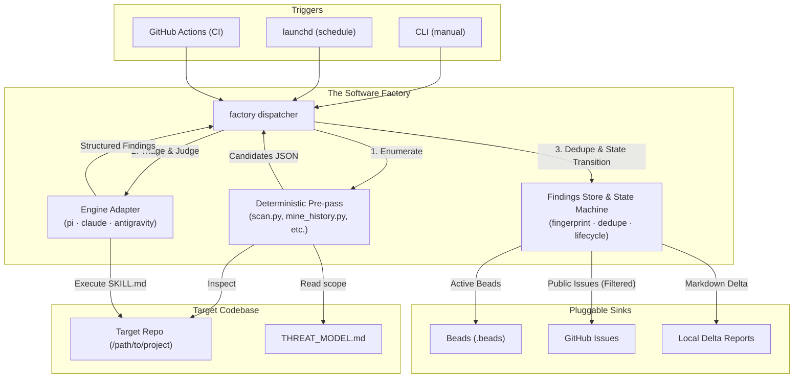

# The Software Factory

A schedulable fleet of software-development-lifecycle (SDLC) agents that run **locally** under your existing developer session auth (`antigravity`, `claude`, `pi`) and **in CI** on GitHub Actions.

Deterministic scanners enumerate; AI models triage, synthesize, and judge. Findings flow directly into whatever issue tracker your target repository already uses (`beads`, `github-issues`, or local reports).

---

## How It Works



### Core Principles

1. **Deterministic-first**: Scanners (`gitleaks`, `npm audit`, `HTMLParser`, custom harnesses) enumerate candidate files and metrics. Models never do work a static tool does faster and cheaper.
2. **Two-plane architecture**: The same portable agent definition (`SKILL.md`) runs locally with your subscription session auth and in CI with repository API keys.
3. **Clean session isolation**: Discovery and verification are separate agents. Discovery optimizes for recall; verification runs in a fresh session prompted strictly to *disprove* the finding.
4. **Propose, don't apply**: Agents open PRs, draft wisps/issues, and generate delta reports. Humans retain the merge control point.
5. **Noise control & stable fingerprinting**: Findings are keyed by `sha256(agent:rule_id:normalized_path:normalized_snippet)`—deliberately excluding line numbers so refactors don't trigger duplicate alerts.
6. **Public disclosure guard**: High and critical security vulnerabilities are never posted to public issue trackers. They are routed to private local stores or draft security advisories.

---

## Quick Start

### Prerequisites

- **Python 3.9+**
- At least one supported AI CLI installed and authenticated:
  - [`pi`](https://github.com/earendil-works/pi-coding-agent) (Google / Gemini / Anthropic session)
  - [`claude`](https://docs.anthropic.com/en/docs/agents-and-tools/claude-code) (Claude Code CLI)
  - [`antigravity`](https://github.com/google) (Headless session API)
- Optional tools depending on target sink:
  - [`bd`](https://github.com/beads-project/beads) (if using the Beads issue tracker)
  - [`gh`](https://cli.github.com/) (if using the GitHub Issues sink)

### 1. List Available Agents

```bash
./factory list
```

### 2. Run an Agent Against a Target

You can run any agent against a registered target name (from `targets/`) or against an arbitrary local directory path:

```bash
# Run secret-scan against a registered target
./factory run secret-scan --target fauxmium

# Run against an arbitrary local repository path
./factory run secret-scan --target /path/to/my-web-app

# Choose a specific AI engine (auto-detects by default)
./factory run threat-model --target fauxmium --engine pi

# Override the issue sink
./factory run vuln-discovery --target fauxmium --sink file
```

### 3. Run a Factory Line (Composition & Andon Cord)

A Factory Line orchestrates multiple agents in sequence across the SDLC. If any station encounters a fatal error or a critical defect (e.g. an exposed secret), the **Andon Cord** immediately halts the line:

```bash
# Run the full SDLC project audit line against a target
./factory line project-audit --target fauxmium

# Run the Web Platform, UI/UX, Resilience, Perf & Memory excellence line
./factory line web-excellence --target fauxmium
```

### 3b. Run the Class C Performance Hill-Climber (`./factory hillclimb`)

The `hillclimb` command runs an iterative optimization loop (`lib/bench/runner.py`) toward a concrete numeric goal (`perf_hazard_score`, `total_gzip_bytes`, or `custom_bench_ms`), recording every kept win and reverted dead-end in `findings/<target>-hillclimb-ledger.jsonl`:

```bash
# Propose hill-climb steps toward 0 performance hazards
./factory hillclimb --target fauxmium --metric perf_hazard_score --goal 0

# Run 3 iterations applying edits in-worktree, re-measuring, keeping wins & reverting regressions
./factory hillclimb --target fauxmium --metric total_gzip_bytes --iterations 3 --apply
```

### 3c. Wire Up Your Daily Workflow (3 Layers)

You can wire the factory into your daily development loop in one command per layer:

```bash
# Layer 1: Sub-second (<150ms) deterministic secret-scan git pre-commit hook (Rule 8 compliant)
./factory hook install --all

# Layer 2: Symlink all 22 agent SKILL.md manifests into ~/.pi/agent/skills, ~/.claude/skills, and ~/.gemini
./factory skills install

# Layer 3: Install macOS launchd daily morning briefing schedules (07:30 / 07:35 / 07:40 AM)
./factory schedule generate && ./factory schedule install --all
```

#### Installing the Skills on Another Machine (`install.sh` / `pi` / `npx skills`)

You can install all 22 skills (plus the `factory` CLI in `~/.local/bin/factory`) onto any machine in a single command:

```bash
# Option 1: Zero-dependency universal installer (installs into pi, Claude, Antigravity & ~/.local/bin/factory)
curl -fsSL https://raw.githubusercontent.com/PaulKinlan/agents/main/install.sh | bash
# Or install a single skill only:
curl -fsSL https://raw.githubusercontent.com/PaulKinlan/agents/main/install.sh | bash -s -- --skill modern-web

# Option 2: Native pi package manager (auto-registers in ~/.pi/agent/settings.json)
pi install git:github.com/PaulKinlan/agents

# Option 3: skills.sh CLI (npx skills)
npx skills add PaulKinlan/agents -g -y
# Or install a single station via skills.sh:
npx skills add PaulKinlan/agents@modern-web -g -y
```

### 4. Run in CI (GitHub Actions Composite Action)

Any repository can invoke Factory agents directly in GitHub Actions using the reusable composite action:

```yaml
# .github/workflows/security.yml in consumer repositories
name: Security Audit
on: [push, pull_request]

jobs:
  audit:
    runs-on: ubuntu-latest
    steps:
      - uses: actions/checkout@v4
      - uses: paulkinlan/agents/.github/actions/factory@main
        with:
          agent: secret-scan
          target: .
          model_api_key: ${{ secrets.GEMINI_API_KEY }}
```

---

## Setting Up Targets

Targets represent repositories the factory audits. Targets are defined as simple YAML files in `targets/<name>.yaml`:

```yaml
# targets/my-service.yaml
name: my-service
path: /Users/username/Code/my-service
sink: file                 # Sink: file | beads | github-issues
visibility: public         # Visibility: public | private (guards disclosure)
agents:
  - secret-scan
  - threat-model
  - vuln-discovery
  - vuln-verify
  - modern-web
  - ui-ux-audit
  - resilience
  - perf-review
  - perf-hillclimb
  - memory-profile
  - bundle-size
schedule:
  secret-scan:
    interval: 86400        # Run daily (in seconds)
  deps-supply-chain:
    interval: 604800       # Run weekly
```

### Target Fields

| Field | Description | Values |
|---|---|---|
| `name` | Unique project identifier used in findings and logs | String (e.g. `my-service`) |
| `path` | Absolute path to the repository on your machine | `/path/to/repo` |
| `sink` | Primary issue tracker where findings should be dispatched | `file` (default) · `beads` · `github-issues` |
| `visibility` | Repository visibility. Prevents public leakage of 0-days | `public` (embargoes high/crit) · `private` |
| `agents` | List of agents enabled for this target | Array of agent names |
| `schedule` | Optional schedule overrides per agent (seconds or clock time) | `interval: 86400` or `hour: 3, minute: 0` |

> [!TIP]
> **Ad-hoc targets**: You don't have to create a YAML file to audit a project. Passing `./factory run <agent> --target /path/to/repo` automatically resolves the target name from the directory and selects `file` sink as a safe default.

---

## The Agent Fleet

The factory includes **22 implemented agents** across 7 SDLC lanes:

### 1. Security & Vulnerability Lane

| Agent | Class | Plane | Description |
|---|---|---|---|
| **`threat-model`** | Observer (A) | Local | Mines git history, commit diffs, and issue records to generate a comprehensive `THREAT_MODEL.md` (trust boundaries, attack surfaces, bug-shape hints, and explicit non-threats). |
| **`secret-scan`** | Observer (A) | Both | Deterministic regex/gitleaks scan + model triage for high-entropy tokens, API keys, private keys, and cloud credentials. |
| **`vuln-discovery`** | Observer (A) | Local | Semantic attack-surface scanner guided by `THREAT_MODEL.md`. Identifies candidate vulnerabilities and models multi-hop exploit chains with high recall. |
| **`vuln-verify`** | Observer (A) | Local | **Adversarial verifier with zero shared context**. Prompted strictly to disprove findings by hunting for upstream sanitizers, auth gates, and framework protections. |
| **`vuln-triage`** | Observer (A) | Both | Deduplicates findings by root cause rather than symptom, evaluates reachability against `THREAT_MODEL.md`, and prepares findings for tracker promotion. |

### 2. Modern Web, UI/UX, Accessibility & Resilience Lane

| Agent | Class | Plane | Description |
|---|---|---|---|
| **`modern-web`** | Proposer (B) | Both | Audits HTML, CSS, and JS against [`modern-web-guidance`](~/.gemini/config/plugins/modern-web-guidance-plugin/skills/modern-web-guidance/SKILL.md) to replace legacy JS/CSS workarounds with native Baseline Web APIs (`<dialog>`, Popover, Anchor Positioning, Container Queries, `:has()`, `:user-valid`, View Transitions, Scroll-Driven Animations). |
| **`ui-ux-audit`** | Proposer (B) | Both | Holistic UI & UX analyzer checking design token consistency, interactive states (`:focus-visible`, `:active`, `:disabled`), async loading/empty/error states, tap targets, dark mode (`light-dark()`), and typography. |
| **`accessibility`** | Observer (A) | Local | Scans HTML files and templates for 6 core WCAG 2.1 AA violation types (missing alt text, unlabelled buttons, missing lang attributes, `tabindex > 0`). |
| **`resilience`** | Proposer (B) | Both | Wraps [`web-resilience-audit`](~/.gemini/config/plugins/web-resilience-plugin/skills/web-resilience-audit/SKILL.md) and `web-resilience-fix` against 46 failure states (offline, `AbortSignal.timeout()`, storage quota errors, FOIT fonts, 3P script SPOFs, tab discard). |

### 3. Performance & Memory Optimizers Lane (Class B & C)

| Agent | Class | Plane | Description |
|---|---|---|---|
| **`perf-review`** | Proposer (B) | Both | Inspects recent git commits and diffs for performance regressions (layout thrashing, sequential `await` waterfalls, render-blocking head assets, LCP/CLS media hazards) and outputs ready-to-apply fix diffs. |
| **`perf-hillclimb`** | Optimizer (C) | Local | Goal-directed optimizer paired with `lib/bench/runner.py`. Iteratively measures metrics, proposes single-step optimizations, verifies improvements, and records reverted dead ends in an append-only ledger. |
| **`memory-profile`** | Optimizer (C) | Local | Wraps [`memory-leak-debugging`](~/.gemini/config/plugins/chrome-devtools-plugin/skills/memory-leak-debugging/SKILL.md) + DevTools MCP. Detects unbounded `Map`/`Set` caches, uncleaned event listeners, `setInterval` leaks, and undisconnected DOM observers. |
| **`bundle-size`** | Optimizer (C) | CI/Local | Measures countable raw/gzipped asset bytes against an append-only baseline. Recommends dynamic `import()` opportunities and budget caps. |

### 4. Inner-Loop Testing & Automated Patching Lane

| Agent | Class | Plane | Description |
|---|---|---|---|
| **`test-gap`** | Proposer (B) | Local | Measures test coverage deficit across source modules and synthesizes executable unit test skeletons using standard runners (`node:test`, `pytest`). |
| **`pr-fixer`** | Proposer (B) | Both | Synthesizes minimal, verified unified diff patches (`proposed_patches`) and branch proposals for active findings or failing CI checks without pushing to default branches. |

### 5. CI, Supply Chain & Repo Triage Lane

| Agent | Class | Plane | Description |
|---|---|---|---|
| **`issue-triage`** | Proposer (B) | CI/Local | Interfaces with GitHub Issues (`gh`) or Beads (`.beads/`). Verifies reproduction steps, flags duplicates, calculates severity, and proposes labels and maintainer triage comments. |
| **`deps-supply-chain`** | Observer (A) | Both | Combines `npm audit` with static import analysis to verify if reported CVEs are actually reachable in runtime code, filtering out dormant devDependencies. |

### 6. Ops, Documentation & Release Lane

| Agent | Class | Plane | Description |
|---|---|---|---|
| **`log-check`** | Observer (A) | Both | Inspects application, test, and server error logs, extracts stack traces, correlates them to source files, identifies root causes, and proposes defensive fixes. |
| **`docs-drift`** | Observer (A) | Both | Parses markdown documentation and cross-references actual code symbols, directory layouts, and CLI flags to detect stale docs. |
| **`docs-write`** | Proposer (B) | Both | Companion to `docs-drift` that generates exact markdown replacement patches (`proposed_markdown_patch`) to synchronize documentation. |
| **`release-notes`** | Proposer (B) | CI/Local | Mines commit history and merged PRs since the last release, synthesizing customer-facing release notes grouped into Features, Fixes, and Breaking Changes. |

### 7. Factory Meta-Assurance Lane

| Agent | Class | Plane | Description |
|---|---|---|---|
| **`qa-station`** | Observer (A) | Both | Meta-agent auditing the precision (`1 - wontfix_rate`), duplicate clusters, remediation completeness, and anatomy contract compliance of all other agents in the fleet. |

---

## Anatomy of an Agent

Every agent lives in `agents/<name>/` and adheres to a strict contract:

```text
agents/<name>/
├── agent.yaml          # Metadata: class, plane, containment, capabilities, budget
├── SKILL.md            # Portable instructions (runs on pi, claude, and antigravity)
├── scripts/            # Deterministic pre-pass tool (Python / shell)
└── report.schema.json  # Output contract enforced on the model's response
```

- **`agent.yaml`**: Declares agent behavior:
  - `class`: `observer` (read-only), `proposer` (opens PRs/issues), `optimizer` (measure-change-remeasure).
  - `containment`: `t0-readonly`, `t1-fetch` (outbound network), `t2-local` (file modifications), `t3-sandbox`.
  - `short_circuit_empty`: `true` if model invocation should be bypassed when the pre-pass finds zero candidates.
- **`SKILL.md`**: Contains **no engine-specific logic**. Engine-specific flags belong in `lib/adapters/`.
- **`scripts/`**: Executable pre-pass script (`scan.py`, `mine_history.py`, etc.) that outputs candidate JSON to stdout or an `--output` path.
- **`report.schema.json`**: JSON Schema validating the model's triage output.

---

## Sinks & Noise Control

### Sinks

When a run completes, findings are dispatched based on target configuration:
- **`file`** (Default): Writes formatted markdown delta reports to `findings/<target>-latest.md` and appends metrics to `findings/<target>-history.jsonl`.
- **`beads`**: For projects using [Beads](https://github.com/beads-project/beads). Active findings automatically create or update issues via `bd create`.
- **`github-issues`**: For GitHub repositories. Creates labeled issues via `gh issue create`.

### Public Disclosure Protection

> [!CAUTION]
> Never publish unembargoed security vulnerabilities to a public tracker.
> - If `visibility: public`, high and critical findings are automatically blocked from public trackers (`github-issues`) and retained in local file reports only.
> - `.gitignore` is configured to exclude `findings/*` and `runs/` so private vulnerability data is never leaked when this repository is pushed.

### Noise Control & State Machine

Findings follow a deterministic lifecycle across runs:

$$\text{new} \longrightarrow \text{accepted} \mid \text{wontfix} \longrightarrow \text{fixed} \longrightarrow \text{regressed}$$

- **Stable Fingerprint**: `sha256(agent:rule_id:normalized_path:normalized_snippet)`. Line numbers are omitted so reformatting or refactoring does not re-alert on existing issues.
- **Delta Reports**: Output reports only emphasize the delta (`X new, Y regressed, Z fixed`). Clean runs produce zero alert noise.
- **Suppressions**: Committed rationales in `findings/suppressions.yaml` transition findings to `wontfix`.

---

## Local Scheduling (macOS `launchd`)

The factory integrates with macOS `launchd` User Agents to run recurring background audits using your local login session authentication.

```bash
# List all schedulable agents and current launchd status
./factory schedule list

# Generate a launchd plist for an agent
./factory schedule generate --target fauxmium --agent secret-scan

# Install and load into ~/Library/LaunchAgents/
./factory schedule install --target fauxmium --agent secret-scan

# Trigger an immediate background run via launchctl
./factory schedule trigger --target fauxmium --agent secret-scan

# Uninstall and unload
./factory schedule uninstall --target fauxmium --agent secret-scan
```

Scheduled jobs log their output to `runs/schedule-<target>-<agent>.stdout.log` and automatically update the target's delta report.

---

## Repository Structure

```text
agents/                            # Fleet of 22 SDLC agents
├── secret-scan/
├── threat-model/
├── vuln-discovery/
├── vuln-verify/
├── vuln-triage/
├── modern-web/
├── ui-ux-audit/
├── accessibility/
├── resilience/
├── perf-review/
├── perf-hillclimb/
├── memory-profile/
├── bundle-size/
├── test-gap/
├── pr-fixer/
├── issue-triage/
├── deps-supply-chain/
├── log-check/
├── docs-drift/
├── docs-write/
├── release-notes/
└── qa-station/
lines/                             # Composed Factory Lines (project-audit.yaml, web-excellence.yaml)
.github/
├── actions/factory/               # Reusable Composite Action for CI
└── workflows/                     # Factory self-audit and test workflows
lib/
├── adapters/                      # Engine bridges: pi.sh, claude.sh, antigravity.sh
├── bench/                         # Class C benchmark harness & hill-climb ledger (runner.py)
├── findings.py                    # Fingerprinting, dedupe, state machine, sink dispatch
└── scheduler.py                   # macOS launchd plist generation and lifecycle
targets/                           # Target project configurations (YAML)
findings/                          # Local findings store, latest delta reports, history, ledgers
runs/                              # Detailed run transcripts and raw model logs (gitignored)
schedules/                         # Generated launchd plists (gitignored)
docs/
└── PLAN.md                        # Master architectural design and research notes
AGENTS.md                          # Repository rules and agent conventions
factory                            # Central CLI dispatcher
```

---

## Reading Order & Further Documentation

1. [**`docs/PLAN.md`**](docs/PLAN.md): Complete architecture specification, threat model research, Mythos analysis, and 9-phase build plan.
2. [**`AGENTS.md`**](AGENTS.md): Factory conventions, containment tiers, and non-negotiables.
3. [**`THREAT_MODEL.md`**](THREAT_MODEL.md): Self-hosting threat model for the factory repository itself.
