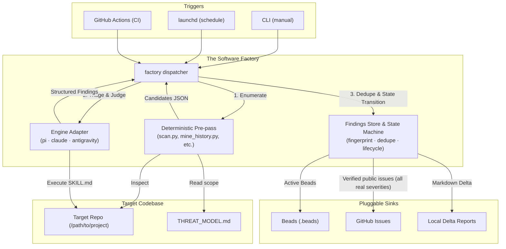

# The Software Factory

A schedulable fleet of software-development-lifecycle (SDLC) agents that run **locally** under your existing developer session auth (`antigravity`, `claude`, `pi`) and **in CI** on GitHub Actions.

Deterministic scanners enumerate; AI models triage, synthesize, and judge. Findings flow directly into whatever issue tracker your target repository already uses (`beads` or local reports; public GitHub issues are triaged separately as public input).

---

## How It Works


```mermaid
flowchart TD
  subgraph Triggers["Triggers"]
    CLI["CLI (manual)"]
    SCHED["launchd (schedule)"]
    GHA["GitHub Actions (CI)"]
  end

  subgraph Factory["The Software Factory"]
    DISP["factory dispatcher"]
    PRE["Deterministic Pre-pass<br/>(scan.py, mine_history.py, etc.)"]
    ENG["Engine Adapter<br/>(pi · claude · antigravity)"]
    STORE["Findings Store & State Machine<br/>(fingerprint · dedupe · lifecycle)"]
  end

  subgraph Targets["Target Codebase"]
    TGT["Target Repo (/path/to/project)"]
    TM["THREAT_MODEL.md"]
  end

  subgraph Sinks["Pluggable Sinks"]
    BD["Beads (.beads)"]
    GH["GitHub Issues"]
    FILE["Local Delta Reports"]
  end

  CLI --> DISP
  SCHED --> DISP
  GHA --> DISP

  DISP -->|"1. Enumerate"| PRE
  PRE -->|"Inspect"| TGT
  PRE -->|"Read scope"| TM
  PRE -->|"Candidates JSON"| DISP

  DISP -->|"2. Triage & Judge"| ENG
  ENG -->|"Execute SKILL.md"| TGT
  ENG -->|"Structured Findings"| DISP

  DISP -->|"3. Dedupe & State Transition"| STORE
  STORE -->|"Active Beads"| BD
  STORE -->|"Verified public issues (all real severities)"| GH
  STORE -->|"Markdown Delta"| FILE
```

### Core Principles

1. **Deterministic-first**: Scanners (`gitleaks`, `npm audit`, `HTMLParser`, custom harnesses) enumerate candidate files and metrics. Models never do work a static tool does faster and cheaper.
2. **Two-plane architecture**: The same portable agent definition (`SKILL.md`) runs locally with your subscription session auth and in CI with repository API keys.
3. **Clean session isolation**: Discovery and verification are separate agents. Discovery optimizes for recall; verification runs in a fresh session prompted strictly to *disprove* the finding.
4. **Propose, don't apply**: Agents open PRs, draft wisps/issues, and generate delta reports. Humans retain the merge control point.
5. **Noise control & stable fingerprinting**: Findings are keyed by `sha256(agent:rule_id:normalized_path:normalized_snippet)`—deliberately excluding line numbers so refactors don't trigger duplicate alerts.
6. **Public disclosure guard**: An explicitly-public target publishes redacted public issues for every real finding, including high/critical; missing visibility fails closed. Human approval is required before creating a linked bead.

---

## Quick Start

### Prerequisites

- **Python 3.9+**
- At least one supported AI CLI installed and authenticated:
  - [`pi`](https://github.com/earendil-works/pi-coding-agent) (Google / Gemini / Anthropic session)
  - [`claude`](https://docs.anthropic.com/en/docs/agents-and-tools/claude-code) (Claude Code CLI)
  - [`antigravity`](https://github.com/google) (Headless session API)
- Optional tools depending on target sink:
  - [`bd`](https://github.com/beads-project/beads) (if using the Beads issue tracker)
  - [`gh`](https://cli.github.com/) (if using the GitHub Issues sink)

### 0. Agent Integration Guidance (`--agent` / `integrate`)

AI coding agents (or developers) can print machine-actionable integration instructions and copy-pasteable workflow recipes directly from the CLI:

```bash
# Print full machine-actionable integration guide for AI agents
./factory --agent

# Or print specific integration recipes directly to stdout
./factory integrate --section github-actions  # GitHub Actions workflows & composite action
./factory integrate --section pre-commit      # Sub-150ms deterministic pre-commit gate
./factory integrate --section target          # targets/<name>.yaml configuration
```

### 1. List Available Agents

```bash
./factory list
```

### 2. Run an Agent Against a Target

You can run any agent against a registered target name (from `targets/`) or against an arbitrary local directory path:

```bash
# Run secret-scan against a registered target
./factory run secret-scan --target fauxmium

# Run against an arbitrary local repository path
./factory run secret-scan --target /path/to/my-web-app

# Choose a specific AI engine (auto-detects by default)
./factory run threat-model --target fauxmium --engine pi

# Override the issue sink
./factory run vuln-discovery --target fauxmium --sink file
```

### 3. Run a Factory Line (Composition & Andon Cord)

A Factory Line orchestrates multiple agents in sequence across the SDLC. The **Andon Cord** immediately halts the line — skipping every downstream station — when a station hits a *genuine* failure (its engine or pre-pass could not run) or a critical defect (e.g. an exposed secret). A station whose engine ran but produced no usable verdict (unparseable or schema-violating output) is a *plumbing* failure, not a genuine one: it gets one bounded repair-retry, then degrades to `ERROR` and the line continues as `INCOMPLETE` rather than halting.

#### Adapter Auth & Environment Failures (`ENV_FAILURE`)

When an engine adapter fails due to missing, invalid, or inaccessible credentials (e.g. `pi` exit 1 with `"No API key found"`, `claude` exit 1 with `"no Claude credentials"`, or missing `DEEPSEEK_API_KEY`):
- It is classified and reported as a named **`ENV_FAILURE` (Environment Failure)**, distinct from a code defect or absent verdict.
- **Never rendered as clean or PASS**: findings count is marked **`UNKNOWN` (`—`)**, not zero. A reader can immediately see that the station could not authenticate and did not run.
- **Single-station runs**: `factory run` prints `[environment failure]` to stderr, writes an `ENVIRONMENT FAILURE` delta report trio, and exits 2.
- **Factory Line behaviour**:
  - If `andon_halt_on_failure: true` (e.g. `project-audit`): the line **halts immediately**, pulls the Andon cord, skips downstream stations, and finishes in state `HALTED` (exit 1).
  - If `andon_halt_on_failure: false` (e.g. `web-excellence`): the failed station is recorded on the scorecard as `ENV_FAILURE` (`-` findings, `-` criticals), downstream stations continue running, and the overall line finishes in state `INCOMPLETE` (exit 1). The delta report displays a prominent `ENVIRONMENT FAILURE` callout and never produces a "Clean Delta" banner.

```bash
# Run the full SDLC project audit line against a target
./factory line project-audit --target fauxmium

# Run the Web Platform, UI/UX, Resilience, Perf & Memory excellence line
./factory line web-excellence --target fauxmium
```

### 3b. Run the Class C Performance Hill-Climber (`./factory hillclimb`)

The `hillclimb` command runs an iterative optimization loop (`lib/bench/runner.py`) toward a concrete numeric goal (`perf_hazard_score`, `total_gzip_bytes`, or `custom_bench_ms`), recording every kept win and reverted dead-end in `findings/<target>-hillclimb-ledger.jsonl`:

```bash
# Propose hill-climb steps toward 0 performance hazards
./factory hillclimb --target fauxmium --metric perf_hazard_score --goal 0

# Run 3 iterations applying edits in-worktree, re-measuring, keeping wins & reverting regressions
./factory hillclimb --target fauxmium --metric total_gzip_bytes --iterations 3 --apply
```

### 3c. Wire Up Your Daily Workflow (3 Layers)

You can wire the factory into your daily development loop in one command per layer:

```bash
# Layer 1: Sub-second (<150ms) deterministic secret-scan git pre-commit hook (Rule 8 compliant)
./factory hook install --all

# Layer 2: Symlink all 22 agent SKILL.md manifests into ~/.pi/agent/skills, ~/.claude/skills, and ~/.gemini
./factory skills install

# Layer 3: Install macOS launchd daily morning briefing schedules (07:30 / 07:35 / 07:40 AM)
./factory schedule generate && ./factory schedule install --all
```

#### Installing the Skills on Another Machine (`install.sh` / `pi` / `npx skills`)

You can install all 22 skills (plus the `factory` CLI in `~/.local/bin/factory`) onto any machine in a single command:

```bash
# Option 1: Zero-dependency universal installer (installs into pi, Claude, Antigravity & ~/.local/bin/factory)
curl -fsSL https://raw.githubusercontent.com/PaulKinlan/agents/main/install.sh | bash
# Or install a single skill only:
curl -fsSL https://raw.githubusercontent.com/PaulKinlan/agents/main/install.sh | bash -s -- --skill modern-web

# Option 2: Native pi package manager (auto-registers in ~/.pi/agent/settings.json)
pi install git:github.com/PaulKinlan/agents

# Option 3: skills.sh CLI (pass -a to target pi/claude-code; omitting -a with -y tries PromptScript which lacks -g support)
npx skills add PaulKinlan/agents -g -a pi claude-code -y
# Or install a single station via skills.sh:
npx skills add PaulKinlan/agents@modern-web -g -a pi -y
```

### 4. Run in CI (GitHub Actions Composite Action)

Any repository can invoke Factory agents directly in GitHub Actions using the reusable composite action:

```yaml
# .github/workflows/security.yml in consumer repositories
name: Security Audit
on: [push, pull_request]

jobs:
  audit:
    runs-on: ubuntu-latest
    steps:
      - uses: actions/checkout@v4
      # Pin the action itself too: `@main` moves under the consumer, and this action runs with
      # your model key and GitHub token.
      - uses: paulkinlan/agents/.github/actions/factory@35ae9c5a428fbcab2c5bf3e1c2ced586db844f6c
        with:
          agent: secret-scan
          target: .
          model_api_key: ${{ secrets.GEMINI_API_KEY }}
```

For complete workflow recipes (PR quality gates, scheduled deep audits, automated issue triage, and matrix runners), see [**`docs/INTEGRATION.md`**](docs/INTEGRATION.md).

---

## Setting Up Targets

Targets represent repositories the factory audits. Targets are defined as simple YAML files in `targets/<name>.yaml`:

```yaml
# targets/my-service.yaml
name: my-service
path: /Users/username/Code/my-service
sink: file                 # Sink: file | beads
visibility: public         # Visibility: public | private (guards disclosure)
trusted: false             # agents-bp0: `true` (+ visibility: private) is the attestation
                           # FACTORY_ALLOW_UNSANDBOXED=1 requires on a host without
                           # bubblewrap; never set it for a public or untrusted repo
agents:
  - secret-scan
  - threat-model
  - vuln-discovery
  - vuln-verify
  - modern-web
  - ui-ux-audit
  - resilience
  - perf-review
  - perf-hillclimb
  - memory-profile
  - bundle-size
schedule:
  secret-scan:
    interval: 86400        # Run daily (in seconds)
  deps-supply-chain:
    interval: 604800       # Run weekly
```

### Target Fields

| Field | Description | Values |
|---|---|---|
| `name` | Unique project identifier used in findings and logs | String (e.g. `my-service`) |
| `path` | Absolute path to the repository on your machine | `/path/to/repo` |
| `sink` | Findings destination | `file` (default) · `beads`; `--sink github-issues` is rejected for findings |
| `visibility` | Explicit publication policy; missing/invalid withholds high/critical from beads | `public` · `private` (beads sink is private/owner-visible; missing/invalid withholds high/critical) |
| `repo` | Explicit public GitHub issue destination (never inferred from `origin`) | `OWNER/REPO` on github.com |
| `beads_path` | Explicit initialized project Beads DB for approved promotion | `/path/to/project` (contains `.beads/`) |
| `agents` | List of agents enabled for this target | Array of agent names |
| `schedule` | Optional schedule overrides per agent (seconds or clock time) | `interval: 86400` or `hour: 3, minute: 0` |

> [!TIP]
> **Ad-hoc targets**: You don't have to create a YAML file to audit a project. Passing `./factory run <agent> --target /path/to/repo` automatically resolves the target name from the directory and selects `file` sink as a safe default. A raw path carries no manifest, so an ad-hoc run that files to `beads` also needs `--visibility public|private`: without it the fail-closed embargo holds every high/critical finding locally. A registered target's own `visibility` is authoritative and is never overridden by the flag.
> The canonical version of this, including the two declarations, the raw-path sink default and the
> log line a withheld finding prints, lives in
> [targets/README.md](targets/README.md#declaring-visibility) — edit there first.

---

## The Agent Fleet

The factory includes **22 implemented agents** across 7 SDLC lanes:

### 1. Security & Vulnerability Lane

| Agent | Class | Plane | Description |
|---|---|---|---|
| **`threat-model`** | Observer (A) | Local | Mines git history, commit diffs, and issue records to generate a comprehensive `THREAT_MODEL.md` (trust boundaries, attack surfaces, bug-shape hints, and explicit non-threats). |
| **`secret-scan`** | Observer (A) | Both | Deterministic regex/gitleaks scan + model triage for high-entropy tokens, API keys, private keys, and cloud credentials. |
| **`vuln-discovery`** | Observer (A) | Local | Semantic attack-surface scanner guided by `THREAT_MODEL.md`. Identifies candidate vulnerabilities and models multi-hop exploit chains with high recall. |
| **`vuln-verify`** | Observer (A) | Local | **Adversarial verifier with zero shared context**. Prompted strictly to disprove findings by hunting for upstream sanitizers, auth gates, and framework protections. |
| **`vuln-triage`** | Observer (A) | Both | Deduplicates findings by root cause rather than symptom, evaluates reachability against `THREAT_MODEL.md`, and prepares findings for tracker promotion. |

### 2. Modern Web, UI/UX, Accessibility & Resilience Lane

| Agent | Class | Plane | Description |
|---|---|---|---|
| **`modern-web`** | Proposer (B) | Both | Audits HTML, CSS, and JS against `modern-web-guidance` to replace legacy JS/CSS workarounds with native Baseline Web APIs (`<dialog>`, Popover, Anchor Positioning, Container Queries, `:has()`, `:user-valid`, View Transitions, Scroll-Driven Animations). |
| **`ui-ux-audit`** | Proposer (B) | Both | Holistic UI & UX analyzer checking design token consistency, interactive states (`:focus-visible`, `:active`, `:disabled`), async loading/empty/error states, tap targets, dark mode (`light-dark()`), and typography. |
| **`accessibility`** | Observer (A) | Local | Scans HTML files and templates for 6 core WCAG 2.1 AA violation types (missing alt text, unlabelled buttons, missing lang attributes, `tabindex > 0`). |
| **`resilience`** | Proposer (B) | Both | Wraps `web-resilience-audit` and `web-resilience-fix` against 46 failure states (offline, `AbortSignal.timeout()`, storage quota errors, FOIT fonts, 3P script SPOFs, tab discard). |

### 3. Performance & Memory Optimizers Lane (Class B & C)

| Agent | Class | Plane | Description |
|---|---|---|---|
| **`perf-review`** | Proposer (B) | Both | Inspects recent git commits and diffs for performance regressions (layout thrashing, sequential `await` waterfalls, render-blocking head assets, LCP/CLS media hazards) and outputs ready-to-apply fix diffs. |
| **`perf-hillclimb`** | Optimizer (C) | Local | Goal-directed optimizer paired with `lib/bench/runner.py`. Iteratively measures metrics, proposes single-step optimizations, verifies improvements, and records reverted dead ends in an append-only ledger. |
| **`memory-profile`** | Optimizer (C) | Local | Wraps `memory-leak-debugging` + DevTools MCP. Detects unbounded `Map`/`Set` caches, uncleaned event listeners, `setInterval` leaks, and undisconnected DOM observers. |
| **`bundle-size`** | Optimizer (C) | CI/Local | Measures countable raw/gzipped asset bytes against an append-only baseline. Recommends dynamic `import()` opportunities and budget caps. |

### 4. Inner-Loop Testing & Automated Patching Lane

| Agent | Class | Plane | Description |
|---|---|---|---|
| **`test-gap`** | Proposer (B) | Local | Measures test coverage deficit across source modules and synthesizes executable unit test skeletons using standard runners (`node:test`, `pytest`). |
| **`pr-fixer`** | Proposer (B) | Both | Synthesizes minimal, verified unified diff patches (`proposed_patches`) and branch proposals for active findings or failing CI checks without pushing to default branches. |

### 5. CI, Supply Chain & Repo Triage Lane

| Agent | Class | Plane | Description |
|---|---|---|---|
| **`issue-triage`** | Proposer (B) | CI/Local | Interfaces with GitHub Issues (`gh`) or Beads (`.beads/`). Verifies reproduction steps, flags duplicates, calculates severity, and proposes labels and maintainer triage comments. |
| **`deps-supply-chain`** | Observer (A) | Both | Combines `npm audit` with static import analysis to verify if reported CVEs are actually reachable in runtime code, filtering out dormant devDependencies. |

### 6. Ops, Documentation & Release Lane

| Agent | Class | Plane | Description |
|---|---|---|---|
| **`log-check`** | Observer (A) | Both | Inspects application, test, and server error logs, extracts stack traces, correlates them to source files, identifies root causes, and proposes defensive fixes. |
| **`docs-drift`** | Observer (A) | Both | Parses markdown documentation and cross-references actual code symbols, directory layouts, and CLI flags to detect stale docs. |
| **`docs-write`** | Proposer (B) | Both | Companion to `docs-drift` that generates exact markdown replacement patches (`proposed_markdown_patch`) to synchronize documentation. |
| **`release-notes`** | Proposer (B) | CI/Local | Mines commit history and merged PRs since the last release, synthesizing customer-facing release notes grouped into Features, Fixes, and Breaking Changes. |

### 7. Factory Meta-Assurance Lane

| Agent | Class | Plane | Description |
|---|---|---|---|
| **`qa-station`** | Observer (A) | Both | Meta-agent auditing the precision (`1 - wontfix_rate`), duplicate clusters, remediation completeness, and anatomy contract compliance of all other agents in the fleet. |

---

## Anatomy of an Agent

Every agent lives in `agents/<name>/` and adheres to a strict contract:

```text
agents/<name>/
├── agent.yaml          # Metadata: class, plane, containment, capabilities, budget
├── SKILL.md            # Portable instructions (runs on pi, claude, and antigravity)
├── scripts/            # Deterministic pre-pass tool (Python / shell)
└── report.schema.json  # Output contract enforced on the model's response
```

- **`agent.yaml`**: Declares agent behavior:
  - `class`: `observer` (read-only), `proposer` (opens PRs/issues), `optimizer` (measure-change-remeasure).
  - `containment`: `t0-readonly`, `t1-fetch` (outbound network), `t2-local` (file modifications), or `t3-sandbox` (refused: no gVisor-class runner exists yet). The tier is a ceiling on the `capabilities` an agent may declare, and every run checks it. The model session runs read-only, except that an agent declaring `write` at `t2-local` is granted a disposable per-session git worktree (`agents-6ce`) to edit files in — but **only when the engine is OS-sandboxed** (just `pi` under a working bubblewrap; `claude` is not kernel-confined, so a `write` declaration there always downgrades to `read-only`, review P1-2). The target checkout stays read-only and the collected session diff is the proposal. On Linux hosts with bubblewrap it also runs inside an OS sandbox that confines it to the target (`lib/sandbox.py`), and — when every model-provider key in play is brokerable — with the network namespace isolated (`--unshare-net`, agents-2x6): the only egress is the per-run egress-allowlist proxy allowlisted to the agent's own `requires` hosts, and the model API calls go through the credential broker via an in-sandbox relay (`lib/net_forward.py`, `lib/egress_proxy.py`). A run that cannot isolate the netns honestly re-withholds a declared `network` and reports `network-egress` as not enforced. On a host where bubblewrap cannot run, a sandbox-confined engine **refuses** instead of degrading — `FACTORY_ALLOW_UNSANDBOXED=1` opts out only for a target that attests `trusted: true` with `visibility: private` in its manifest (agents-bp0), and the banner/`policy.json` then name the opt-in. See [THREAT_MODEL.md](THREAT_MODEL.md) §6.1 and §7.
  - `short_circuit_empty`: `true` if model invocation should be bypassed when the pre-pass finds zero candidates.
- **`SKILL.md`**: Contains **no engine-specific logic**. Engine-specific flags belong in `lib/adapters/`.
- **`scripts/`**: Executable pre-pass script (`scan.py`, `mine_history.py`, etc.) that outputs candidate JSON to stdout or an `--output` path.
- **`report.schema.json`**: JSON Schema validating the model's triage output.

---

## Sinks & Noise Control

### Sinks

When a run completes, findings are dispatched based on target configuration:
- **`file`** (Default): Writes formatted markdown delta reports to `findings/<target>-latest.md` and appends metrics to `findings/<target>-history.jsonl`. In a `factory line`, each station writes `findings/<target>-<agent>-delta.md` and the line writes the run's `findings/<target>-delta.md` (plus machine-readable `findings/<target>-line.json`) once, from every station. A station that produced no verdict (pre-pass/engine failure, timeout, unparseable or schema-violating output) is `ERROR`, the run is `INCOMPLETE`, never "Clean Delta", and the command exits non-zero.
- **Severity**: reports, the store and the andon count the *triaged* severity (`unclassified` when missing; triaged false positives are evidence, not public work). `routing_severity` remains fail-closed when visibility is undeclared. The beads sink files medium and above (low and info are skipped; missing/invalid visibility withholds high/critical); sensitive values are redacted from tracker prose. The sink reports published / skipped / duplicate / failed counts.
- **`beads`**: Findings dispatch to beads **automatically** (agents-eyo): internal findings file directly into the target's configured `beads_path` without a public GitHub issue and without a human triage gate. Medium and above severities file (low and info are skipped); a target without explicit `visibility` withholds high/critical from the synced tracker (`embargo_reason`). Bead creation is deduped by fingerprint (`external_ref: factory:<fingerprint>`), so re-runs do not duplicate open beads; a finding that was fixed and reappears (`regressed`) with its prior bead closed files a new bead.
- **Public GitHub issues & Promotion**: Public GitHub issues are exclusively for **public input**, not a findings sink; `--sink github-issues` is rejected for findings. The `issue-triage` station reads public issues, and after human triage applies the `factory-approved` label, `./factory promote --target NAME --issue https://github.com/OWNER/REPO/issues/NUMBER` creates at most one linked bead using a repo-scoped fingerprint external ref (`factory:github.com/OWNER/REPO:<fingerprint>`), links the issue URL on the bead, and comments the bead ID on the issue. Promotion must run from the same factory checkout whose `findings/<target>.json` produced the issue; stores are not shared between worktrees. If the configured project Beads DB is missing or unreadable, promotion refuses instead of guessing a DB.

- **`command`**: For other trackers, set `sink: command` and `sink_command: "<argv>"` in the target manifest, with optional `sink_timeout` and `sink_env: [NAMES]`. The command reads redacted, embargo-filtered JSON Lines (`factory-sink/1`), reports per-finding receipts, and writes redacted stderr privately in the run directory. See `lib/sinks/command.py`.

Sink implementations use the registry and `Sink`/`SinkContext` interface in `lib/sinks/`; the local report remains the complete evidence trail.

**QA precision needs lifecycle observations.** `qa-station` aggregates valid records
across all readable `findings/*.json` stores in the *same factory checkout* that runs it;
these stores are gitignored, not shared between worktrees. `--target` validates and labels
the audit target; it does **not** select a single findings store. If there are no valid
lifecycle records across those stores (including when none exist or all are empty),
`qa-no-findings-store` marks a measurement gap, not evidence of a clean fleet. After the
owner-managed project-audit line has populated that checkout's store, inspect
its per-agent volume, `wontfix_rate` and `estimated_precision` without a model call:
`python3 agents/qa-station/scripts/audit_factory_quality.py --target . --output /tmp/qa-audit.json`.
The estimates describe recorded lifecycle states, not human-validated precision;
`new` findings with no `wontfix` dispositions do not certify 100% precision.
Do not copy a private findings store into Git to make a QA scorecard appear.

### Public Disclosure Policy

> [!IMPORTANT]
> Findings file to the target's Beads DB automatically without a public issue or human gate (agents-eyo). Public GitHub issues are exclusively for public-input triage (`issue-triage`), never a direct findings sink; `--sink github-issues` is rejected for findings. Missing or invalid target `visibility` withholds high/critical findings from the synced beads tracker (`embargo_reason`). `.gitignore` keeps raw `findings/*` and `runs/` out of Git; tracker prose is redacted, but reviewers must still consider the disclosure policy before opting a target in.

### Noise Control & State Machine

Findings follow a deterministic lifecycle across runs:

$$\text{new} \longrightarrow \text{accepted} \mid \text{wontfix} \longrightarrow \text{fixed} \longrightarrow \text{regressed}$$

- **Stable Fingerprint**: `sha256(agent:rule_id:normalized_path:normalized_snippet)`. Line numbers are omitted so reformatting or refactoring does not re-alert on existing issues.
- **Delta Reports**: Output reports only emphasize the delta (`X new, Y regressed, Z fixed`). Clean runs produce zero alert noise.
- **Suppressions**: Committed rationales in `findings/suppressions.yaml` transition findings to `wontfix`.

---

## Local Scheduling (macOS `launchd`)

The factory integrates with macOS `launchd` User Agents to run recurring background audits using your local login session authentication.

```bash
# List all schedulable agents and current launchd status
./factory schedule list

# Generate a launchd plist for an agent
./factory schedule generate --target fauxmium --agent secret-scan

# Install and load into ~/Library/LaunchAgents/
./factory schedule install --target fauxmium --agent secret-scan

# Trigger an immediate background run via launchctl
./factory schedule trigger --target fauxmium --agent secret-scan

# Uninstall and unload
./factory schedule uninstall --target fauxmium --agent secret-scan
```

Scheduled jobs log their output to `runs/schedule-<target>-<agent>.stdout.log` and automatically update the target's delta report.

---

## Run Artifact Retention

Every `factory run` writes a run directory under `runs/<agent>-<target>-<timestamp>/`
holding the run record (`policy.json`), raw scanner matches (`candidates.json`,
`prompt.txt`) and model output (`model_output.txt`, `rejected_report.json`). Those
artifacts can embed matched secret values and raw model output, so the factory applies
a bounded retention policy **whenever a new run directory is created**:

- **Count bound** — keep the `FACTORY_RUN_RETENTION` most-recent run directories
  (default `20`). This is the hard guarantee: however fast runs are produced, at most
  this many run directories survive.
- **Age bound (TTL)** — prune any run directory older than
  `FACTORY_RUN_RETENTION_AGE_DAYS` whole days (default `30`), even if it is within the
  count bound.

```bash
# Keep 50 runs instead of 20, and expire anything older than 7 days
FACTORY_RUN_RETENTION=50 FACTORY_RUN_RETENTION_AGE_DAYS=7 ./factory run secret-scan --target voicebox
```

Pruning is explicit and safe: the run directory being written is never removed;
symlinks are never followed (and are left in place); non-directory files such as the
scheduler's `schedule-*.stdout.log` and the hill-climb `runs/hillclimb-<target>-<run_id>/`
proposal directories are never swept (they are proposals, not run records). If a run
crashes mid-way, its partial directory is still the newest entry and survives that pass;
it is pruned on a later run once it is old enough or falls past the count bound. See
`lib/retention.py` for the exact policy.

**Active-run guard** — a concurrently running `factory` (e.g. a scheduled scan) must
never sweep another process's still-running run directory, even when many fast runs
overflow the count bound. Each run directory carries a `.active` marker created at
allocation; pruning skips any directory whose marker is fresher than
`FACTORY_RUN_ACTIVE_GRACE_SECONDS` (default `3600`, one hour). The marker is removed
when the run completes successfully; a run that crashes or is hard-killed leaves its
marker behind, and the grace bounds how long that stale marker protects the directory
before it is swept. Set `FACTORY_RUN_ACTIVE_GRACE_SECONDS` larger than your longest
station `budget.max_minutes` if you override budgets.

---

## Repository Structure

```text
agents/                            # Fleet of 22 SDLC agents
├── secret-scan/
├── threat-model/
├── vuln-discovery/
├── vuln-verify/
├── vuln-triage/
├── modern-web/
├── ui-ux-audit/
├── accessibility/
├── resilience/
├── perf-review/
├── perf-hillclimb/
├── memory-profile/
├── bundle-size/
├── test-gap/
├── pr-fixer/
├── issue-triage/
├── deps-supply-chain/
├── log-check/
├── docs-drift/
├── docs-write/
├── release-notes/
└── qa-station/
lines/                             # Composed Factory Lines (project-audit.yaml, web-excellence.yaml)
.github/
├── actions/factory/               # Reusable Composite Action for CI
└── workflows/                     # Factory self-audit and test workflows
lib/
├── adapters/                      # Engine bridges: pi.sh, claude.sh, antigravity.sh
├── bench/                         # Class C benchmark harness & hill-climb ledger (runner.py)
├── findings.py                    # Fingerprinting, dedupe, state machine, sink dispatch
└── scheduler.py                   # macOS launchd plist generation and lifecycle
targets/                           # Target project configurations (YAML)
findings/                          # Local findings store, latest delta reports, history, ledgers
runs/                              # Detailed run transcripts and raw model logs (gitignored)
schedules/                         # Generated launchd plists (gitignored)
docs/
├── INTEGRATION.md                 # Agent and CI/CD integration guide
└── PLAN.md                        # Master architectural design and research notes
AGENTS.md                          # Repository rules and agent conventions
factory                            # Central CLI dispatcher
```

---

## Reading Order & Further Documentation

1. [**`docs/PLAN.md`**](docs/PLAN.md): Complete architecture specification, threat model research, Mythos analysis, and 9-phase build plan.
2. [**`docs/INTEGRATION.md`**](docs/INTEGRATION.md): Machine-actionable integration guide for AI agents and CI/CD pipelines.
3. [**`AGENTS.md`**](AGENTS.md): Factory conventions, containment tiers, and non-negotiables.
4. [**`THREAT_MODEL.md`**](THREAT_MODEL.md): Self-hosting threat model for the factory repository itself.
