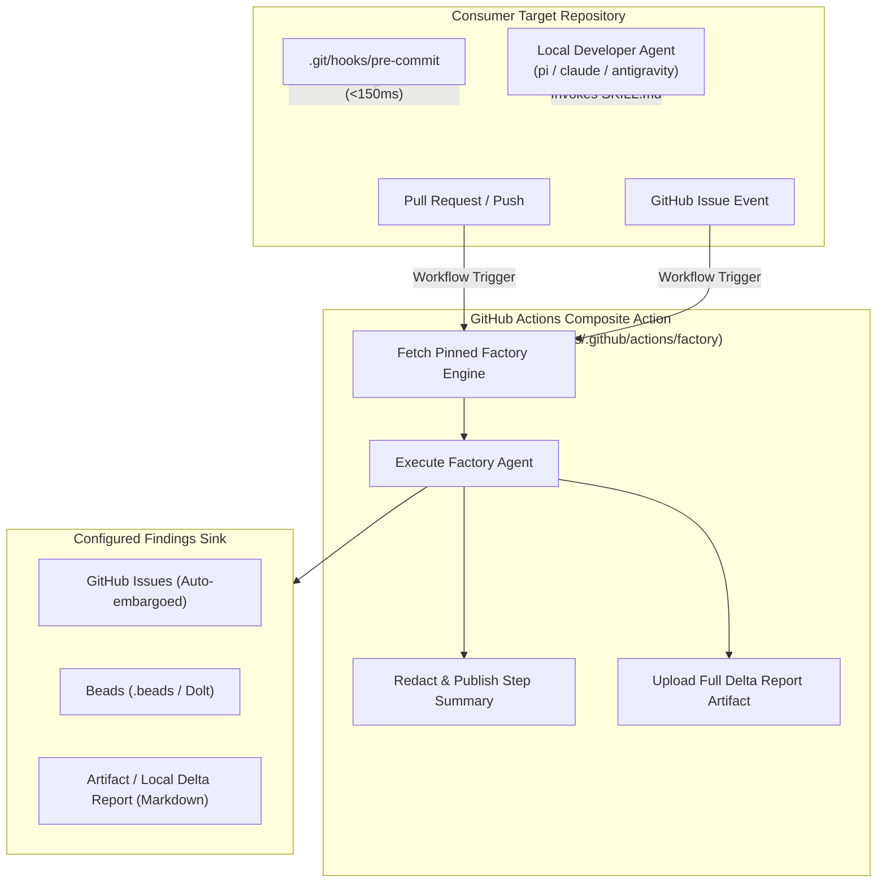

# The Software Factory — Integration & Automation Guide

> **Audience**: AI Coding Agents (Codex, Claude, Pi, Antigravity) and engineers tasked with configuring, integrating, or automating Software Factory tools within a target repository or CI/CD pipeline.

This guide provides machine-actionable specifications, copy-pasteable configurations, and decision trees for integrating the Software Factory across four operational planes:
1. [**CI/CD Plane (GitHub Actions)**](#1-cicd-plane-github-actions): Automated PR gating, nightly audits, and issue triage.
2. [**Pre-Commit Plane (Layer 1)**](#2-pre-commit-plane-layer-1-deterministic-gate): Sub-150ms zero-model git hooks.
3. [**Target Enrolment Plane (Layer 3)**](#3-target-enrolment-plane-local-fleet--scheduler): Registering targets and scheduling background runs.
4. [**Interactive Skills Plane (Layer 2)**](#4-interactive-skills-plane-local-agent-tools): Equipping local AI agents (`pi`, `claude`, `antigravity`) with factory skills.

---

## Quick Reference: Integration Planes



---

## 1. CI/CD Plane: GitHub Actions

The Software Factory provides an official, reusable composite action located at:
```text
paulkinlan/agents/.github/actions/factory@<ref>
```

> [!IMPORTANT]
> **Security Rule**: In production workflows, pin the action to a specific commit SHA rather than `@main` (e.g., `paulkinlan/agents/.github/actions/factory@185fcb43a11d214d1eca3c52a6b3b02c160c18cc`). This prevents unexpected upstream changes from modifying build security.

### 1.1 Action Inputs & Outputs

| Input | Type | Required | Default | Description |
|---|---|---|---|---|
| `agent` | String | **Yes** | — | Name of the factory agent to execute (e.g., `secret-scan`, `deps-supply-chain`, `docs-drift`, `modern-web`, `bundle-size`, `issue-triage`). |
| `target` | String | No | `.` | Path to the target repository directory relative to workspace root. |
| `engine` | String | No | `auto` | Engine adapter to run: `auto`, `pi`, `claude`, or `antigravity`. |
| `sink` | String | No | `file` | Findings destination: `file` (markdown artifacts), `github-issues`, or `beads`. |
| `model_api_key` | Secret | Optional* | `""` | Inference API key (`GEMINI_API_KEY` or `ANTHROPIC_API_KEY`). *Required for agents requiring AI model triage. |
| `github_token` | Secret | Optional* | `""` | GitHub token (`${{ secrets.GITHUB_TOKEN }}`). *Required for `sink: github-issues` or reading issues/PRs. |
| `factory_ref` | String | No | *(pinned)* | 40-character commit SHA of the Software Factory repository to fetch. |

| Output | Description |
|---|---|
| `status` | Run status (`success`, `failure`, or `andon-halt`). |
| `new_findings` | Integer count of net-new findings discovered in this run. |
| `delta_report` | Path to generated markdown delta report. |

### 1.2 Required Permissions & Secrets

Configure least-privilege permissions in your workflow:

```yaml
permissions:
  contents: read          # Default read-only access for code scans
  issues: write          # ONLY required if using `sink: github-issues` or `agent: issue-triage`
  pull-requests: read    # Required if analyzing PR metadata
```

**Secrets**:
- `GEMINI_API_KEY` (Recommended) or `ANTHROPIC_API_KEY`: Add as a Repository Secret in **Settings → Secrets and variables → Actions**.
- `GITHUB_TOKEN`: Standard ephemeral token provided automatically by GitHub Actions (`${{ secrets.GITHUB_TOKEN }}`). Never use a static Personal Access Token (PAT).

### 1.3 Security & Public Disclosure Guardrails

The composite action enforces strict security policies out of the box:
1. **Credential Erasure during Setup**: `fetch_factory.sh` blanks all environment tokens and model keys while downloading factory code, preventing prompt leakage or third-party tampering.
2. **Step Summary Redaction (agents-pgj)**: `GITHUB_STEP_SUMMARY` is readable by any logged-in GitHub user on public repositories. The action masks secret values and withholds prose/PoC details for High/Critical findings.
3. **Authenticated Full Reports**: The complete, unredacted delta report is uploaded as a private, authenticated workflow artifact (`factory-delta-report-<agent>`).
4. **Public Sink Embargo**: If a target repository is public, `sink: github-issues` automatically blocks filing High or Critical issues to prevent zero-day disclosure.

---

### 1.4 Production Workflow Recipes

#### Recipe A: Pull Request & Push Quality Gate
File: `.github/workflows/software-factory-pr.yml`
Runs deterministic pre-passes and lightweight triage across PRs and pushes to `main`.

```yaml
name: Software Factory PR Quality Gate

on:
  push:
    branches: [main]
  pull_request:
    branches: [main]

concurrency:
  group: ${{ github.workflow }}-${{ github.ref }}
  cancel-in-progress: true

permissions:
  contents: read

jobs:
  audit:
    name: ${{ matrix.agent }}
    runs-on: ubuntu-latest
    strategy:
      fail-fast: false
      matrix:
        agent:
          - secret-scan
          - deps-supply-chain
          - docs-drift
    steps:
      - name: Checkout target repository
        uses: actions/checkout@v4
        with:
          fetch-depth: 0

      - name: Run Factory Agent (${{ matrix.agent }})
        uses: paulkinlan/agents/.github/actions/factory@main
        with:
          agent: ${{ matrix.agent }}
          target: '.'
          sink: file
          model_api_key: ${{ secrets.GEMINI_API_KEY }}
          github_token: ${{ secrets.GITHUB_TOKEN }}
```

#### Recipe B: Scheduled Nightly Deep SDLC Audit
File: `.github/workflows/software-factory-nightly.yml`
Runs deep code health, modern web, and performance audits on a nightly schedule.

```yaml
name: Software Factory Nightly Audit

on:
  schedule:
    - cron: '0 3 * * *' # Every night at 03:00 UTC
  workflow_dispatch:     # Allow manual on-demand execution

concurrency:
  group: software-factory-nightly
  cancel-in-progress: false

permissions:
  contents: read

jobs:
  deep-scan:
    name: Run ${{ matrix.agent }}
    runs-on: ubuntu-latest
    strategy:
      fail-fast: false
      matrix:
        agent:
          - modern-web
          - bundle-size
          - test-gap
          - resilience
    steps:
      - name: Checkout repository
        uses: actions/checkout@v4
        with:
          fetch-depth: 0

      - name: Run Factory Agent
        uses: paulkinlan/agents/.github/actions/factory@main
        with:
          agent: ${{ matrix.agent }}
          target: '.'
          sink: file
          model_api_key: ${{ secrets.GEMINI_API_KEY }}
          github_token: ${{ secrets.GITHUB_TOKEN }}
```

#### Recipe C: Automated GitHub Issue Triage
File: `.github/workflows/software-factory-triage.yml`
Automatically analyzes incoming issues, checks reproduction steps, deduplicates, and labels.

```yaml
name: Software Factory Issue Triage

on:
  issues:
    types: [opened, edited]

concurrency:
  group: issue-triage-${{ github.event.issue.number }}
  cancel-in-progress: true

permissions:
  contents: read
  issues: write

jobs:
  triage:
    # Security guardrail: only run for collaborators with write permission or repo members
    if: github.event.issue.author_association == 'OWNER' || github.event.issue.author_association == 'COLLABORATOR' || github.event.issue.author_association == 'MEMBER'
    runs-on: ubuntu-latest
    steps:
      - name: Checkout repository
        uses: actions/checkout@v4

      - name: Triage Issue
        uses: paulkinlan/agents/.github/actions/factory@main
        with:
          agent: issue-triage
          target: '.'
          sink: github-issues
          model_api_key: ${{ secrets.GEMINI_API_KEY }}
          github_token: ${{ secrets.GITHUB_TOKEN }}
```

---

## 2. Pre-Commit Plane (Layer 1: Deterministic Gate)

Under **Rule 8** of the Factory doctrine:
> *No model calls in a blocking trigger. Anything a human waits on (pre-commit, pre-push) runs deterministic tools only, with a sub-five-second budget.*

The pre-commit scanner runs in **under 150ms** and blocks secrets or fatal syntax errors from entering git history.

### 2.1 One-Line Hook Installation

From a cloned Software Factory repository:
```bash
# Install hook into target repository
./factory hook install --target /path/to/target/project

# Or install across all registered targets in targets/
./factory hook install --all
```

### 2.2 Standalone Pre-Commit Hook Script
If configuring directly within a target repository's `.git/hooks/pre-commit`:

```bash
#!/usr/bin/env bash
# .git/hooks/pre-commit
set -euo pipefail

# Path to the Software Factory repository (or local installation)
FACTORY_DIR="${SOFTWARE_FACTORY_DIR:-$HOME/agents}"

if [ -f "$FACTORY_DIR/agents/secret-scan/scripts/scan.py" ]; then
  # Run deterministic pre-pass on staged changes
  python3 "$FACTORY_DIR/agents/secret-scan/scripts/scan.py" --target . --fail-on-findings
fi
```

Make executable:
```bash
chmod +x .git/hooks/pre-commit
```

---

## 3. Target Enrolment Plane (Local Fleet & Scheduler)

To configure a target repository for local audits and scheduled morning briefings:

### 3.1 Create `targets/<project-name>.yaml`

Create a YAML manifest inside the Factory's `targets/` folder:

```yaml
# targets/my-service.yaml
name: my-service
path: /Users/username/Code/my-service
sink: file                 # Sink: file | beads | github-issues
visibility: public         # Visibility: public | private
agents:
  - secret-scan
  - threat-model
  - vuln-discovery
  - modern-web
  - bundle-size
  - docs-drift
schedule:
  secret-scan:
    hour: 7
    minute: 30             # Runs daily at 07:30 AM
  modern-web:
    interval: 86400        # Runs every 24 hours (seconds)
```

### 3.2 Sink Selection Guide

| Sink | Description | When to Choose |
|---|---|---|
| **`file`** | Writes markdown delta reports to `findings/<target>-latest.md` and appends history to `findings/<target>-history.jsonl`. | **Default choice.** Safe for all public and private targets; zero external API or tracker dependencies. |
| **`github-issues`** | First step: verified public `github.com/OWNER/REPO` issue, deduped against open and closed issues by fingerprint. Store issue URL and append lifecycle comments. | Explicit `repo:` and `visibility: public` required in the target manifest. All real severities (including high/critical) publish under Paul's public-disclosure approval; issue prose is redacted. Failed listing fails closed. |
| **`beads`** | Not an automatic publication sink. `--sink beads` / combined sinks refuse to create work before public triage. | Human-approved, explicit issue-to-bead promotion follows as a separate operation; until available, triage in GitHub and do not auto-file beads. |

### 3.3 Scheduling Daily Briefings (macOS `launchd`)

Install background daemons that run automatically under your local developer session:

```bash
# Generate launchd configuration
./factory schedule generate --target my-service

# Install and activate daemons
./factory schedule install --target my-service

# Check active status
./factory schedule list
```

---

## 4. Interactive Skills Plane (Local Agent Tools)

Agents operating interactively (such as Pi, Claude Code, Codex, or Antigravity) can directly leverage the Factory's 22 portable skill definitions (`SKILL.md`).

### 4.1 Installation Commands

```bash
# Method 1: Universal Zero-Dependency Installer (Links to pi, Claude, Antigravity, and ~/.agents/skills)
curl -fsSL https://raw.githubusercontent.com/PaulKinlan/agents/main/install.sh | bash

# Method 2: Install via skills.sh CLI
npx skills add PaulKinlan/agents -g -a pi claude-code -y

# Method 3: Native Pi package manager
pi install git:github.com/PaulKinlan/agents

# Method 4: Local checkout symlink
./factory skills install
```

### 4.2 Installed Locations

- **Pi Coding Agent**: `~/.pi/agent/skills/<skill-name>/SKILL.md`
- **Claude Code**: `~/.claude/skills/<skill-name>/SKILL.md`
- **Universal / Codex**: `~/.agents/skills/<skill-name>/SKILL.md`
- **Antigravity / Gemini**: `~/.gemini/config/plugins/software-factory-plugin/skills/`

---

## 5. Agent Fleet Reference & CI Compatibility

| Agent Name | SDLC Lane | Class | CI Plane? | Pre-Pass Deterministic Tool | Model Required? | Description |
|---|---|---|---|---|---|---|
| **`secret-scan`** | Security | Observer | **Yes** | `scan.py` (regex + entropy) | For triage | Scans repository for exposed API keys, private keys, and high-entropy credentials. |
| **`deps-supply-chain`** | Security | Observer | **Yes** | `audit_deps.py` (`npm audit` + AST) | For reachability | Discovers dependency CVEs and checks runtime import reachability. |
| **`threat-model`** | Security | Observer | Local / Nightly | `mine_history.py` (git diffs + issues) | Yes | Synthesizes comprehensive trust boundary and attack surface model. |
| **`vuln-discovery`** | Security | Observer | Local / Nightly | `scan_surface.py` | Yes | Guided attack surface exploration with high recall. |
| **`vuln-verify`** | Security | Observer | Local | `verify_finding.py` | Yes | Independent adversarial verifier prompted strictly to disprove vulnerabilities. |
| **`vuln-triage`** | Security | Observer | **Yes** | `cluster_findings.py` | Yes | Deduplicates findings by root cause and maps to `THREAT_MODEL.md`. |
| **`modern-web`** | Web Platform | Proposer | **Yes** | `scan_modern_web.py` (AST/regex) | Yes | Proposes replacements of legacy JS/CSS with native Baseline APIs (`<dialog>`, popover, container queries). |
| **`ui-ux-audit`** | Web Platform | Proposer | **Yes** | `audit_ui.py` (DOM & CSS scanner) | Yes | Evaluates design tokens, interactive focus states, tap targets, and responsive layout. |
| **`accessibility`** | Web Platform | Observer | **Yes** | `scan_a11y.py` (HTML validator) | For triage | Flags WCAG 2.1 AA violations (missing alt, tap sizes, contrast, landmarks). |
| **`resilience`** | Web Platform | Proposer | **Yes** | `audit_resilience.py` | Yes | Evaluates network, offline, storage quota, and 3P failure handling. |
| **`perf-review`** | Performance | Proposer | **Yes** | `scan_perf.py` (diff hazard scanner) | Yes | Identifies layout thrashing, sequential await waterfalls, and render-blocking scripts. |
| **`bundle-size`** | Performance | Optimizer | **Yes** | `measure_bundle.py` (file sizes) | For budget advice | Enforces gzipped asset budgets and suggests dynamic import code splitting. |
| **`perf-hillclimb`** | Performance | Optimizer | Local | `runner.py` (benchmarks) | Yes | Iterative optimization loop against numeric performance metrics. |
| **`memory-profile`** | Performance | Optimizer | Local | `profile_memory.py` | Yes | Identifies event listener leaks, unclosed streams, and retained DOM nodes. |
| **`test-gap`** | Testing | Proposer | **Yes** | `measure_coverage.py` | Yes | Detects untested functions and synthesizes runnable test skeletons. |
| **`pr-fixer`** | Patching | Proposer | **Yes** | `generate_patch.py` | Yes | Generates minimal unified diff patches for active findings without pushing directly. |
| **`issue-triage`** | Operations | Proposer | **Yes** | `fetch_issue.py` | Yes | Verifies issue reproduction steps, flags duplicates, and labels issues. |
| **`docs-drift`** | Documentation | Observer | **Yes** | `check_docs.py` (link & tree parser) | For triage | Detects missing files, obsolete flags, and broken code references in documentation. |
| **`docs-write`** | Documentation | Proposer | **Yes** | `diff_docs.py` | Yes | Generates exact markdown documentation patches to sync docs with code. |
| **`release-notes`** | Operations | Proposer | **Yes** | `mine_commits.py` | Yes | Groups commits and PRs into customer-facing release notes. |
| **`log-check`** | Operations | Observer | **Yes** | `parse_logs.py` | Yes | Correlates application stack traces with source lines to propose defensive fixes. |
| **`qa-station`** | Meta | Observer | **Yes** | `audit_agents.py` | Yes | Audits agent precision, duplicate rates, and output contract compliance across the fleet. |

---

## 6. Autonomous Agent Execution Checklist

When an autonomous AI agent is prompted to *"Set up Software Factory for this repository"*, execute the following sequence:

1. **Inspect Target Repository**:
   - Check if the repository is public or private (`git remote -v` or GitHub API).
   - Check existing issue trackers: Does `.beads/` exist? Is GitHub Issues active?
2. **Create GitHub Actions Workflow**:
   - Create `.github/workflows/software-factory-pr.yml` using [Recipe A](#recipe-a-pull-request--push-quality-gate).
   - If scheduled scans are requested, create `.github/workflows/software-factory-nightly.yml` using [Recipe B](#recipe-b-scheduled-nightly-deep-sdlc-audit).
   - If issue triage is requested, create `.github/workflows/software-factory-triage.yml` using [Recipe C](#recipe-c-automated-github-issue-triage).
3. **Notify User Regarding Secrets**:
   - Alert the user to ensure `GEMINI_API_KEY` (or `ANTHROPIC_API_KEY`) is populated in repository secrets.
4. **Configure Local Pre-Commit Hook (Optional)**:
   - If local git hooks are enabled, configure `.git/hooks/pre-commit` as detailed in [Section 2](#2-pre-commit-plane-layer-1-deterministic-gate).
5. **Verify with a Dry Run**:
   - Test by running `python3 agents/secret-scan/scripts/scan.py --target .` or dispatching a GitHub Action run.
