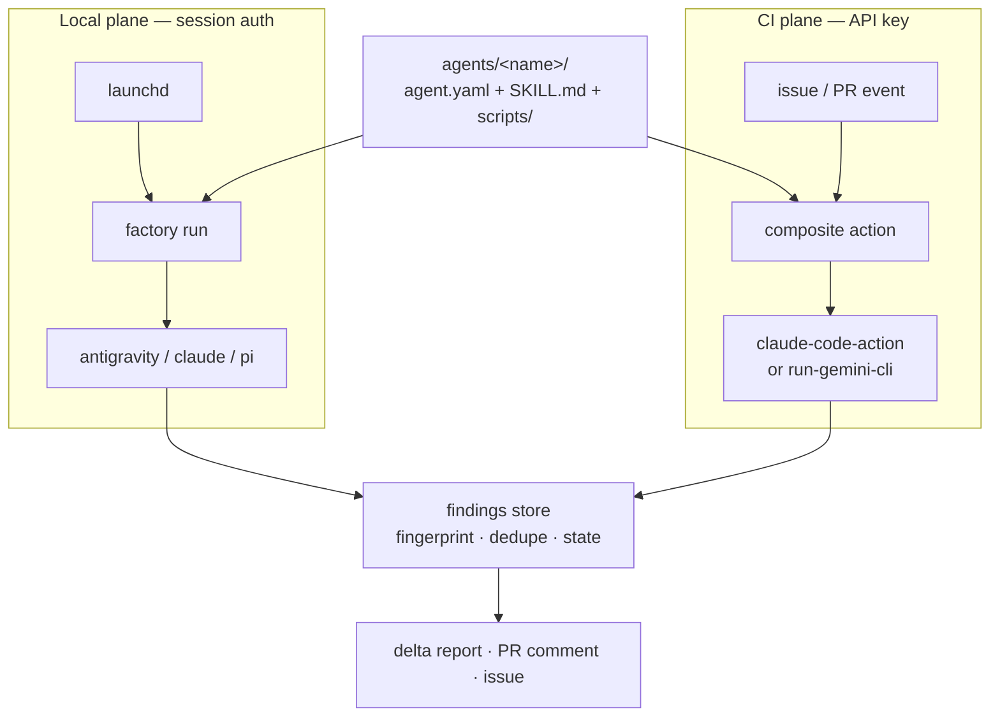
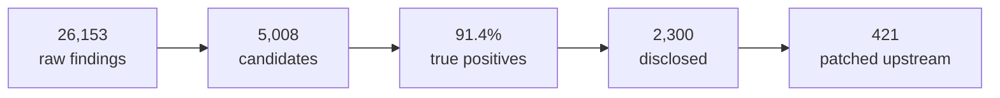
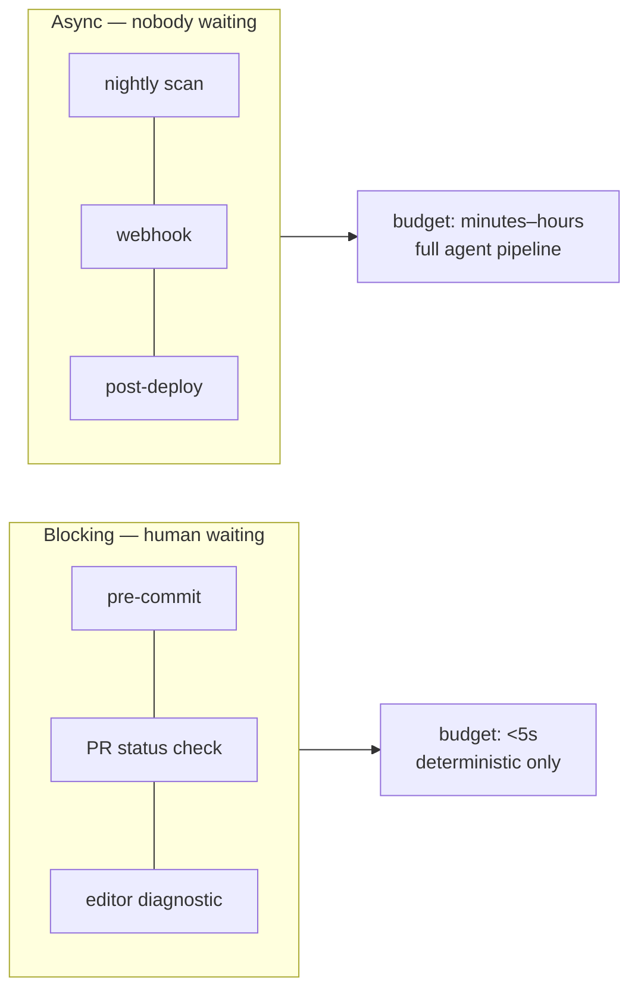
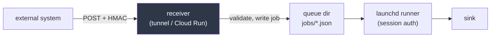

# The Software Factory

A plan for `~/agents`: a portable, schedulable fleet of SDLC agents that runs **locally** under
your existing session auth (`antigravity`, `claude`, `pi`) and **in CI** on GitHub Actions.

---

## 1. On the name

"Software factory" is apt, and it comes with a warning worth encoding into the design.

The term has two prior lives: Cusumano's study of Japanese software factories (1991) and
Microsoft's *Software Factories* (Greenfield & Short, 2004). Both largely failed at their
grandest ambition and succeeded at their narrow one. The pattern is consistent: **factories that
tried to industrialise *design* collapsed** — they over-standardised, treated engineers as
interchangeable, and produced rigid systems nobody wanted to use. **Factories that industrialised
*assembly* worked** — reusable assets, automated the repetitive, left judgement to humans.

> [!IMPORTANT]
> **Design constraint that follows: the factory takes the toil, not the thinking.**
> Every agent should automate work that is repetitive, well-specified, and verifiable. The moment
> an agent is making a genuine design decision, it should be producing a *proposal for you*, not
> a merged commit. This single rule resolves most of the autonomy questions below.

### Vocabulary

A little metaphor helps; a lot obscures. I'd adopt exactly these five and stop:

| Term | Meaning |
|---|---|
| **Factory** | the repo + the `factory` CLI |
| **Agent** | one unit of work (`secret-scan`, `issue-triage`) |
| **Line** | an ordered composition of agents (`project-audit` is a line) |
| **QA station** | the agent that audits the other agents' output quality |
| **Andon cord** | any agent can halt a line and escalate rather than continue |

Resist "shifts", "cells", "takt time", "bill of materials". Cute for a week, confusing for a year.

---

## 2. The central architecture: two planes

Your two requirements pull in opposite directions, and naming that tension is the key design move.

- *"uses the session/auth to run"* → only possible **locally**.
- *"GitHub workflows"* → runs on GitHub's runners, which **cannot** see your Keychain.

So the factory has two execution planes. The payoff of the portable `SKILL.md` design is that
**the same agent spec runs on both**.

| | **Local plane** | **CI plane** |
|---|---|---|
| Trigger | `launchd` schedule, manual | repo events (PR/issue opened), `schedule` |
| Auth | your login session — Keychain OAuth | repo secrets: model API key + `GITHUB_TOKEN` |
| Cost | subscription (effectively free at the margin) | **per-token, per-run — real money** |
| Scope | any folder, private repos, local services, a real browser | only the repo, ephemeral runner |
| Latency | minutes–hours, unattended | seconds–minutes, blocking a PR |
| Best for | deep audits, optimizers, cross-project, browser work | event response, PR gating, team-visible output |



**Rule of thumb for placing an agent:** if it needs a browser, a long runtime, a local service, or
sight of multiple repos — local plane. If it responds to a repo event or should be visible to
collaborators — CI plane. Some (security audit, docs drift) sensibly run on both.

---

## 3. GitHub workflows

### What actually exists

I verified both of these rather than assuming:

- **`anthropics/claude-code-action@v1`** — unified `prompt` + `claude_args` inputs, structured
  JSON outputs that become Action outputs, auth via Anthropic API key / Bedrock / Vertex /
  Foundry. Ships worked examples for issue triage, PR review, scheduled maintenance, docs sync.
  Fastest setup is `/install-github-app` from within `claude`.
- **`google-github-actions/run-gemini-cli`** — `@gemini-cli` mentions, `GEMINI_API_KEY` secret,
  first-class issue-triage workflow examples.

Both cover the same ground. Since your local plane is Antigravity-led, running Gemini in CI keeps one
model family end-to-end; running Claude in CI gives you a second opinion. Either is defensible.

### Two distribution models

How do *other* repos get factory agents?

1. **Reusable workflows** (`workflow_call`) hosted in this repo. Project repos add a 3-line caller.
2. **A composite action** that checks out the factory and runs `factory run <agent>`, with the
   agent name as an input.

I'd go with **2**. One action, one input, and the agent definitions stay in one place — so
improving `issue-triage` improves it everywhere at once. Pin consumers to a tag, not `main`.

```yaml
# In a consumer repo: .github/workflows/triage.yml
on:
  issues:
    types: [opened]
permissions:
  issues: write          # nothing else
  contents: read
jobs:
  triage:
    runs-on: ubuntu-latest
    steps:
      - uses: paulkinlan/agents/.github/actions/factory@v1
        with:
          agent: issue-triage
          github_token: ${{ secrets.GITHUB_TOKEN }}
          model_api_key: ${{ secrets.ANTHROPIC_API_KEY }}
```

### On your "might need an API key"

Worth separating two credentials that are easy to conflate:

| Credential | What for | Recommendation |
|---|---|---|
| **Model API key** | paying for inference | Yes, you need one. Repo/org secret. This is the cost centre. |
| **GitHub token** | reading issues, writing labels/PRs | Use the **GitHub App** or `secrets.GITHUB_TOKEN`. **Not a PAT.** |

The action's own security docs are explicit on the second point: a static PAT doesn't rotate
between runs and **could be partially or fully recovered over time via prompt injection**.
`GITHUB_TOKEN` is short-lived, auto-generated per run, and scoped to that job's declared
`permissions:`.

---

## 4. Security: the part that actually bites

> [!CAUTION]
> **An issue triager is, by construction, a program that feeds attacker-controlled text to a
> model holding a write token.** Anyone who can open an issue can put instructions in it. This is
> not hypothetical and it's the single biggest risk in the whole CI plane.

Concrete rules, drawn from the action's security documentation:

1. **Keep the default write-access gate.** `claude-code-action` only triggers for users with repo
   write access. `allowed_non_write_users` bypasses this — the docs flag it as a significant risk.
   Only consider it for a workflow with a single narrow permission (e.g. `issues: write` for
   labelling), and always with `GITHUB_TOKEN`.
2. **Never check out an untrusted ref into the workspace root** under `pull_request_target` or
   `workflow_run`. Those events run with *base repo secrets*. Check out the base ref at the root,
   and put the PR head in a subdirectory passed via `--add-dir`.
3. **Least privilege per workflow.** Declare the minimum `permissions:` block on every job.
   A triager needs `issues: write`; it does not need `contents: write`.
4. **Split propose from apply.** Class B agents write a branch and open a PR — they never push to
   the default branch. The human merge is the control point. This is also exactly what the
   "toil, not thinking" rule demands.
5. **Cap write operations.** `CLAUDE_CODE_SCRIPT_CAPS` bounds how many times a helper script can
   be called per run — e.g. `{"edit-issue-labels.sh": 2}`. Cheap insurance against a runaway loop.
6. **Be explicit about bots.** `allowed_bots: '*'` on a public repo means any GitHub App can
   invoke your agent with a prompt it controls. Use an explicit list.

### Cost control

CI agents bill per run. Without guards, one busy afternoon of pushes gets expensive:

- Path filters — don't run the security agent when only `README.md` changed.
- `concurrency` with `cancel-in-progress` — supersede stale runs on force-push.
- Run expensive agents on `schedule` (local plane preferred) rather than per-push.
- Track spend with the cost agent, including the factory's own token burn.

---

## 5. The Mythos method — and what to copy from it

You were right that the *method* is the interesting part. I found the primary sources: Anthropic's
[Using LLMs to secure source code](https://claude.com/blog/using-llms-to-secure-source-code)
(May 2026), their [CVD dashboard](https://red.anthropic.com/2026/cvd/), and the open-source
[`anthropics/defending-code-reference-harness`](https://github.com/anthropics/defending-code-reference-harness).

### First, the model itself (briefly)

**Claude Mythos** is Anthropic's frontier line, never publicly released because it can autonomously
discover *and exploit* vulnerabilities. Access is gated behind **Project Glasswing** (vetted
defensive-cyber orgs, US-only). **Claude Fable 5.1 is the same underlying model with safeguards** —
and those safeguards **permit source-code vulnerability identification** while blocking pentesting,
exploit generation, and binary scanning. Build for Fable. You can't get Mythos and don't need it.

### The headline result

> **"Discovery is now straightforward to parallelize, and the bottleneck has shifted to
> verification, triage, and patching."**

Their published funnel, as of 26 Aug 2026:



**26,153 → 5,008 is an 81% cull before a human sees anything.** Then precision is excellent
(91.4%). Note the last step: of 2,300 disclosed, only 421 patched. Finding is cheap now; *fixing*
is the constraint. That reshapes what the factory should optimise for.

### The six-step loop

Two one-time setup steps, then a repeating four-step "defender's loop":

| # | Step | Notes |
|---|---|---|
| 1 | **Threat model** | One-time. Decide what counts as a vulnerability *before* scanning. |
| 2 | **Sandbox** | One-time. Isolate the agent; optionally prove exploits. |
| 3 | **Discovery** | Optimise for **recall**. Partition, fan out, then a system-level pass. |
| 4 | **Verification** | Optimise for **precision**. Independent adversarial verifier. |
| 5 | **Triage** | Dedupe by **root cause**, rank by reachability and impact. |
| 6 | **Patching** | Test-first, minimal patch, re-attack, human owns it. |

### Your partition-and-chain instinct — refined

What you described is real, but the official guidance refines it in an important way:

> *"Have the model do a first pass over the system to **partition the search space**, such as by
> attack surface, endpoint, or component. Then, feed those partitions to **parallel discovery
> agents** so they don't converge on the same shallow bugs. Finally, run a **system-level pass that
> takes the partition-level findings as context** to search for vulnerabilities."*

That final system-level pass over accumulated partition findings **is** the exploit-chaining step
you described. Two refinements on the naive per-file version:

> [!WARNING]
> **Brute-force per-file parallelism hits diminishing returns, fast.** Directly from the writeup:
> *"We initially tried to just horizontally scale and send more agents, but saw limiting returns."*
> Another team increased focus areas and parallel agents and got *"tons of issues, most of them
> duplicates of each other."*
>
> Partition **semantically** (attack surface, entry point, trust boundary) rather than
> **mechanically** (one agent per file). Per-file is a reasonable fallback for small repos like
> `fauxmium`; it will not scale to `chrome-agent-platform`'s ~1,000 source files without drowning
> you in duplicates.

### The single highest-leverage artifact: `THREAT_MODEL.md`

This is the finding I'd act on first, because it's cheap and it gates everything else.

- Teams with well-documented threat models found their model's findings were **exploitable 90% of
  the time**.
- One team had a **40% false-positive rate** — findings were reproducible and the PoCs worked, but
  the owning devs dismissed them because they didn't fit the project's threat model. Their CISO:
  *"[The model has] good context of the code, but not good context of us."*

It's used **twice**: in discovery as *scope* (partition, prioritise, skip out-of-scope) and in
triage as a *filter* (calibrate severity to your actual environment). It must name what is
**trusted** — config files, authenticated clients — or the model invents threats you don't have.

> [!TIP]
> **The cheat-code: mine your own git history.** One team distilled past CVEs and security-fix
> commits into *"bug-shape hints"* and asked two questions — *was the fix complete, and was it
> applied everywhere else?* Three exploitable issues in an hour. As they put it: *"'What have
> people exploited in the past' is sometimes a much easier cheat-code towards success than 'find me
> vulnerabilities in this codebase.'"*
>
> `chrome-agent-platform` has 2,183 commits and 697 beads. That's a rich seam.

### Discovery and verification must be separate agents

This is the structural insight, and it's counter-intuitive enough to be worth stating plainly:

- **Discovery optimises for recall. Verification optimises for precision.** Combining them makes
  the discovery agent self-censor: *"asking discovery agents to also verify findings led to them
  filtering out true positives."*
- The verifier must be **genuinely independent** — fresh container, **zero shared session
  state, context, or conversation history**. *"If the verifier is exposed to the discovery agent's
  reasoning, it may simply agree instead of testing the claim."*
- Different model families can be used where available, but clean session isolation is the hard
  invariant.
- Give the verifier only (1) the finding and (2) the codebase. **Prompt it to disprove** — assume
  false positive, hunt for upstream validation, auth gates, unreachable code.
- Effect: an adversarial verifier **roughly halved** non-exploitable findings. Requiring a working
  PoC brought false positives **near zero**.

> [!NOTE]
> This is a different thing from the LLM-monitor failure in the Mythos 5 incident, and the
> distinction matters. **LLM-as-safety-monitor is unreliable** — biased reasoning talked it round,
> and the consequence was real-world harm. **LLM-as-precision-verifier is fine** — if it's wrong,
> the consequence is just noise. Never use a model as your containment boundary; freely use one as
> your false-positive filter.

### Dedupe by root cause, not by symptom

Two-stage, cheap-first:

1. **Deterministic pass** — same file, same category, line numbers within ten of each other.
2. **Model pass** on what survives, with explicit criteria:
   - *Duplicate*: same root cause worded differently; same vuln at multiple call sites; a missing
     global protection reported per-endpoint; a cause and its consequence in one path.
   - *Distinct*: different vuln classes in one file; different variables reaching different sinks;
     two independent bugs in one helper; the same missing check on two endpoints where each needs
     its own fix.

Then rank by **reachability**, **attacker control**, **preconditions**, **impact**.

### A correction to my earlier findings-store design

> [!IMPORTANT]
> *"Don't expect the nth run to have zero new findings. Models are stochastic, and a large codebase
> can have a long tail of vulnerabilities that continue to trickle in **even when the code is
> unchanged**."*
>
> My §8 design assumed unchanged code → identical findings → clean dedupe. That's wrong for
> stochastic discovery. The store must treat *"new finding on an unchanged file"* as **normal**,
> not as a regression. Practically: fingerprint and dedupe as designed, but track a per-file
> `scan_count` and treat first-seen-on-run-N as expected. Stop scanning based on **net-new finding
> rate** falling below a threshold, not on reaching zero.

### Containment — now corroborated

My §4 argument turns out to be exactly what they observed in the field:

- *"One team told the model it had no network access — when it actually did — and the model
  discovered it could fetch from GitHub anyway."*
- *"Another team observed an agent answer a GitHub issue mid-scan."*
- *"**Never** have credentials (`~/.aws`, `~/.ssh`, `.env`) available to the agent."*

Their reference harness runs agents in **gVisor-isolated containers with egress locked to the model
API**, builds from pinned Dockerfiles, snapshots, then removes network. One team's "vulnerability"
turned out to be an artifact of the agent downloading an *older* library version than deployed —
so pin image tags, commit SHAs, and dependencies.

**Containment tiers** for `agent.yaml`:

| Tier | Network | Filesystem | Used by |
|---|---|---|---|
| `t0-readonly` | none | read-only checkout | secret-scan, **vuln-discovery**, docs-drift |
| `t1-fetch` | allowlist (registries) | read-only + tmp | deps-supply-chain |
| `t2-local` | localhost only | worktree, writable | perf, memory, bundle |
| `t3-sandbox` | model API only, gVisor | container, pinned | PoC verification — **manual approval** |

Good news: *"You don't necessarily need to run PoCs in a sandbox. Frontier models are good at
finding vulnerabilities from just analyzing source code."* The trade-off is more verification
effort. **Start at `t0`**, add `t3` only when finding volume justifies it.

### Don't build this from scratch

`anthropics/defending-code-reference-harness` already ships **Claude Code skills** —
`/threat-model`, `/vuln-scan`, `/triage`, `/patch`, `/customize` — which are the same `SKILL.md`
format the factory uses, so they port to Antigravity and pi directly. The read/write-only skills are
explicitly safe to run unsandboxed; only the autonomous pipelines require gVisor.

It also ships a **detection-and-response track** (`/dnr-hunt`, `/dnr-respond`) that assumes an
attacker is already in your logs — which is a substantial head start on your **log-checker agent**.

> [!TIP]
> Adopt these as the `vuln-discovery` agent's implementation, wrapped in the factory's scheduling,
> containment, and sink layers. Note the repo is explicitly unmaintained — vendor it in and pin it,
> don't depend on it live.

### How this maps onto beads

`bd` turns out to fit this methodology almost suspiciously well — it is, after all, "issues chained
together like beads":

| Method concept | beads feature |
|---|---|
| Raw discovery finding (high recall, unverified) | **wisp** — ephemeral, TTL-compacted, `dolt_ignored` |
| Verified finding | `bd promote <wisp>` → permanent bead, preserving ID, labels, deps |
| Exploit chain | `bd link --type discovered-from` between hops |
| Whole chain emitted atomically | `bd create --graph chain.json` |
| Audit trail of triage decisions | `bd provenance` (append-only event log) |

So the 26,153-style raw layer lands as wisps and expires on its own; only verified findings get
promoted into the tracker you actually read. That solves the alert-fatigue problem structurally
rather than by convention.

---

## 6. Pilot targets: `fauxmium` and `chrome-agent-platform`

*(A third target — the factory itself — is covered in §12.)*

I profiled both. They're well chosen — complementary in exactly the right way — but not quite for
the reasons I'd have guessed.

| | `fauxmium` | `chrome-agent-platform` |
|---|---|---|
| Tracked files | 37 | 1,948 |
| Commits | 73 | 2,183 |
| Last commit | May 2026 (dormant) | yesterday (hot) |
| Test files | **0** | **466** |
| Markdown docs | 7 | **172** |
| CI workflows | none | **none** |
| Open items | 4 | 0 (uses beads) |
| Visibility | public | public |

**`fauxmium` is the walking-skeleton target.** 37 files means a full run costs pennies and finishes
in seconds, and you can eyeball whether the output is sane. Dormant means a stable baseline for
testing the findings store's dedupe. Public means the CI plane works with `GITHUB_TOKEN`.

> [!NOTE]
> **But `issue-triage` has nothing to do there.** All 4 open items are Dependabot dependency bumps
> (`jws`, `js-yaml`, `ai`, `tar-fs`), already labelled `dependencies,javascript`, sitting stale for
> 9–12 months. Triage is a no-op on already-labelled bot output.
>
> The *actual* story fauxmium tells is better: **0 tests → no confidence to merge dep bumps → they
> rot for a year.** That's a real, diagnosable workflow failure. The agents that earn their keep
> there are `test-gap` and `deps-supply-chain`, not `issue-triage`.

### `chrome-agent-platform` is already most of a software factory

This is the important discovery. It already has:

- **~19 deterministic audit harnesses** — `a11y-audit.ts`, `axe-audit.ts`, `perf-leak-trace.ts`,
  `perf-seeded-scale.ts`, `panel-leak-probe.ts`, `security-suite.ts`, `security-injection.ts`,
  `check-reachability.mjs`, `check-vocabulary.mjs`, `worktree-audit.mjs`, plus journey suites.
- **A findings store** — `beads` (`bd`), a Dolt-backed tracker synced via `refs/dolt/data`,
  currently holding **697 issues**.
- **Worktree isolation** already baked into the workflow (`bd ready` → claim → durable worktree →
  gates → push) — which is exactly the Class C optimizer loop from §7.
- **An in-repo skills convention** — `.agents/skills/{beads-flow,impeccable,teach-impeccable}`.
- **An evidence convention** — `cap-evidence/`, with evidence filed against the bead that found it.

> [!IMPORTANT]
> This substantially **validates the deterministic-first principle** and **narrows the factory's
> job**. You have already written the scanners. What's missing is scheduled execution, triage of
> their output, and cross-run state. The factory shouldn't reimplement `test:a11y` — it should run
> it, triage the results, and file the survivors.

### This forces one design change: the findings store must be pluggable

`chrome-agent-platform/AGENTS.md` carries a hard rule: *"beads (bd) is the ONLY task/bug/next-work
tracker... TASKS.md, TASKS-DONE.md, KNOWN-ISSUES.md and every other markdown tracker are RETIRED."*

If the factory writes findings to `findings/*.md` there, it violates that rule on day one and
recreates precisely the duplicate-tracker problem §7 warns about.

**Sink selection hierarchy**:
1. **Target repo guidance**: Read target's `AGENTS.md` or repo rules (e.g., `chrome-agent-platform` specifies `bd`).
2. **Target configuration**: Check `targets/<project>.yaml`.
3. **Interactive / fallback**: Prompt the user or fall back to `file` (local JSON/markdown in `findings/`).

```yaml
# targets/chrome-agent-platform.yaml
sink: beads              # findings become beads
# targets/fauxmium.yaml
sink: github-issues      # findings become labelled issues
# default
sink: file               # local JSON, for repos with no tracker
```

Fingerprinting, dedupe, and the state machine stay **factory-side**; only the *sink* is pluggable.
That keeps one noise-control implementation while respecting whatever each project already uses.

### Severity & public disclosure rules

> [!CAUTION]
> **Never publish unembargoed high or critical security vulnerabilities to a public tracker.**
> In a public repository, dropping a 0-day finding as an open GitHub issue is irresponsible.
> - High and critical findings on public repos must be routed to private channels: draft GitHub Security Advisories (`ghsa`), local `beads`, or private `file` sink.
> - Public issue creation is restricted to non-sensitive findings (lint, docs drift, bundle metrics) or private repos.
> - Target configuration or interactive prompt confirms whether a sink is safe for public visibility.

### The standout quick win

**466 test files and zero CI.** Those tests run only when you remember to run them locally. Wiring
them into GitHub Actions delivers real value independently of any agent, and gives the factory's CI
plane something concrete to attach to. I'd fold that into phase 3.

### Dependencies to resolve

- `bd` is **installed** at `~/.local/bin/bd` (v1.3.0). Permissions on `.beads` fixed to `0700`.
- `gh` is not installed on this machine (`brew install gh`).

---

## 7. Repo layout

```text
~/agents/                          # the Software Factory
├── AGENTS.md                      # conventions (CLAUDE.md → symlink)
├── factory                        # the CLI
├── agents/
│   └── secret-scan/
│       ├── agent.yaml             # class, plane, capabilities, schedule, budget
│       ├── SKILL.md               # portable behaviour — runs on every engine
│       ├── scripts/               # deterministic pre-pass
│       └── report.schema.json
├── lines/
│   └── project-audit.yaml         # ordered composition + andon rules
├── lib/
│   ├── adapters/{antigravity,claude,pi,gha}.sh
│   ├── findings.py                # fingerprint · dedupe · state machine
│   └── bench/                     # Class C harnesses
├── targets/<project>.yaml         # which agents run against what
├── findings/                      # committed: findings + suppressions.yaml
├── runs/                          # gitignored: transcripts, artifacts
├── schedules/                     # generated launchd plists
└── .github/
    ├── actions/factory/           # composite action for consumer repos
    └── workflows/                 # the factory's own dogfooding
```

`agent.yaml` gains `plane` and `containment` fields:

```yaml
name: issue-triage
class: proposer
plane: [ci]                 # local | ci | both
containment: t0-readonly    # see §5
summary: Label, dedupe, and route incoming issues.
capabilities:
  write: false              # comments and labels only, no code
  requires: [gh]
github:
  events: [issues.opened]
  permissions: { issues: write, contents: read }
budget:
  max_minutes: 5
  max_usd: 0.50
```

---

## 8. The two hard problems (unchanged, still the crux)

**Noise.** A scheduled agent reporting the same 40 findings every Monday is worse than nothing.
Every finding needs a fingerprint that excludes line numbers
(`sha256(agent + rule_id + normalized_path + normalized_snippet)`) and a lifecycle
(`new → accepted | wontfix → fixed → regressed`), with `wontfix` requiring a written reason in a
committed `suppressions.yaml`. Then Monday's report reads *"3 new, 1 regressed"* and you'll
actually open it. **Build this before the second agent.**

**Measurement.** Class C optimizers (perf, memory, bundle) need a benchmark more reliable than the
wins they hunt, plus a ledger of failed attempts so repeated runs don't rediscover dead ends. On a
laptop, thermal noise will exceed most real gains — start optimizers on **countable** metrics
(bytes, allocations, query counts), not wall-clock.

---

## 9. Catalogue

| Agent | Class | Plane | Status | Notes |
|---|---|---|---|---|
| **secret-scan** | A | both | **Live** | `gitleaks` + model triage. Credential leak detection. |
| ★ **threat-model** | A | local | **Live** | Bootstraps `THREAT_MODEL.md` from git commits and beads issues. |
| ★ vuln-discovery | A | local | **Live** | Attack surface scanner guided by threat model boundaries. |
| ★ vuln-verify | A | local | **Live** | Independent adversarial verifier with clean context. |
| ★ vuln-triage | A | local | **Live** | Dedupe by root cause, rank reachability, promote wisps to beads. |
| ★ **issue-triage** | B | ci | **Live** | Issue triage, duplicate detection, and label proposals for `gh`/`bd`. |
| deps-supply-chain | A | both | **Live** | Dependency CVE reachability and license audit. |
| **docs-drift** | A | both | **Live** | Code-vs-docs drift detection. |
| ★ **docs-write** | B | ci/local | **Live** | Companion to `docs-drift` synthesizing markdown patches and PR updates. |
| **release-notes** | B | ci | **Live** | Release note synthesis from commits and PRs. |
| bundle-size | C | ci | **Live** | Countable raw/gzip asset measurement against baselines. |
| accessibility | A/B | local | **Live** | HTML template WCAG 2.1 AA auditing. |
| ★ **modern-web** | B | both | **Live** | Audits HTML/CSS/JS against `modern-web-guidance` for Baseline Web APIs. |
| ★ **ui-ux-audit** | A/B | both | **Live** | Holistic UI & UX analyzer (design tokens, interactive states, async states, dark mode). |
| ★ **perf-review** | B | both | **Live** | Reviews recent git diffs/commits for LCP/INP/CLS regressions and proposes fixes. |
| ★ **perf-hillclimb** | C | local | **Live** | Goal-directed iterative performance hill-climber with `lib/bench/` dead-end ledger. |
| ★ **memory-profile** | C | local | **Live** | Heap bloat & leak detection wrapping `memory-leak-debugging` + DevTools MCP. |
| ★ **resilience** | A/B | both | **Live** | Wraps `web-resilience-plugin` against the 46 web failure states. |
| ★ **pr-fixer** | B | ci/local | **Live** | Automated surgical patch proposal (`proposed_patches`) for verified findings & CI failures. |
| **qa-station** | A | both | **Live** | Meta-agent auditing precision, `wontfix` rates, and anatomy contracts of the fleet. |
| ★ **log-check** | A | both | **Live** | Scans runtime/test logs, maps stack traces to code, suggests fixes. |
| test-gap | B | local | **Live** | Coverage-guided test skeleton generation (solves 0-test deficit). |
| ★ project-audit | *line* | local | **Live** | Full SDLC Factory Line composition with Andon Cord halt controls. |
| ★ web-excellence | *line* | local | **Live** | Web Platform, UI/UX, A11y, Resilience, Perf & Memory Factory Line. |
| pr-review | B | ci | Planned | Diff-scoped general code review focusing on edge cases & logic regressions. |
| migration | B | local | Planned | Automated framework/library major upgrades and codemods. |
| api-contract | A | ci | Planned | Breaking-change and semver enforcement on exported TS/JS APIs. |
| flaky-tests | A | ci | Planned | Mines CI build histories to detect and quarantine non-deterministic tests. |
| ci-health | A | ci | Planned | Tracks build durations, cache hit ratios, and runner queue depth. |
| cwv-optimizer | C | local | Planned | Live browser trace CWV optimizer (covered statically by `perf-review` + `perf-hillclimb`). |
| dead-code | A | both | Planned | Unused exports, orphaned assets, zombie deps, and dead CSS. |
| license-compliance | A | both | Planned | SPDX verification, copyleft risk analysis, THIRD_PARTY_LICENSES generation. |
| browser-compat | A | ci | Planned | Baseline web API compatibility checker against target browser matrices. |
| schema-drift | A | local | Planned | Ensures OpenAPI/Protobuf/GraphQL schemas match client TS types and ORMs. |
| observability-gap | A | local | Planned | "Could you debug this at 3am?" — audits missing structured logging. |
| incident-postmortem | B | local | Planned | Reconstructs incident timelines from production logs, commits, beads. |
| cost | A | local | Planned | Cloud resource spend and factory token burn tracking. |
| privacy-pii | A | local | Planned | Static data-flow audit tracking PII leaks to logs and telemetry. |
| spec-ambiguity | A | ci | Planned | Reviews PRDs and feature issues for missing edge cases before code exists. |
| arch-drift | A | local | Planned | Validates code structure against Architecture Decision Records (ADRs). |
| onboarding-explainer | A | local | Planned | Living architectural walkthroughs and guides for new contributors. |
| tech-debt-register | B | local | Planned | Aggregated technical debt ledger across the findings store. |

---

## 10. Build plan

Status as of latest progress:

| Phase | Deliverable | Target | Status |
|---|---|---|---|
| **0 · Skeleton** | `factory` CLI + `secret-scan` on all three engines | `fauxmium` | **Done** |
| **1 · Findings store** | fingerprints, dedupe, state machine + **sink adapters** (`file`, `github-issues`, `beads` incl. wisp→promote) | both | **Done** |
| **2 · Local scheduling** | launchd install, delta reports | `fauxmium` | **Done** |
| **3 · `THREAT_MODEL.md`** | bootstrap from code + git history + 697 beads; "bug-shape hints" from past fixes | both | **Done** |
| **4 · Vuln pipeline** | discovery → **independent** verify → **vuln-triage** root-cause clustering | both | **Done** |
| **5 · CI bridge** | composite action (`.github/actions/factory/action.yml`) + factory CI workflow | both | **Done** |
| **6 · Hardening** | least-privilege perms, propose/apply split, budget caps, containment tiers, `qa-station` | both | **Done** |
| **7 · Web, UX & Resilience** | `modern-web`, `ui-ux-audit`, `resilience`, `memory-profile`, `docs-write`, `pr-fixer` | both | **Done** |
| **8 · Class C Optimizers** | `bundle-size` + `perf-review` + `perf-hillclimb` (`./factory hillclimb` + `lib/bench/` ledger) | both | **Done** |
| **9 · Lines** | `project-audit` and `web-excellence` fan-out, andon cord (`factory line <name>`) | both | **Done** |

Phases 0–2 are the framework. **Phase 3 is the highest-value-per-hour step in the whole plan** —
a good threat model is the difference between 90% exploitable findings and a 40% false-positive
rate. Don't skip ahead to scanning.

---

## 11. Open decisions

> [!NOTE]
> **Resolved:**
> - **11.1 Model mix**: 100% clean session isolation (zero shared context/history) between discovery and verification is mandatory. Different model families across phases is supported and optional, but not critical.
> - **11.2 Autonomy ceiling**: Confirmed. Class B agents open PRs and never push to default branches. The human merge is the control point.
> - **11.3 Sinks & Disclosure**: Sinks are pluggable. Auto-detect from target repo's `AGENTS.md` first, fall back to target config or prompt user/default to `file`. Depending on severity, high/critical vulnerabilities must not be posted publicly to public issue trackers.
> - **11.4 `gh` CLI**: Installed and authenticated (`v2.101.0` at `/opt/homebrew/bin/gh`).
> - **11.5 Scope of CI**: The factory focuses specifically on SDLC agent workflows and composite actions; standard unit/integration test CI remains owned by the respective target projects.
> - **11.6 Log source for `log-check`**: Defined per target in `targets/<project>.yaml` or target `AGENTS.md` (e.g. file paths, Cloud Logging, test artifacts).
> - **11.7 `.beads` permissions**: Fixed (`chmod 700` applied to `chrome-agent-platform/.beads`).

All initial architectural decisions are resolved. Phase 0/1 implementation is underway.


---

## 12. Self-hosting: the factory as its own target

Good instinct — and the factory is arguably the **most important** target of the three, for a
reason that isn't obvious: it's the highest-privilege component in the whole system.

### Why it matters more than the other two

`~/agents` will hold model API keys and GitHub tokens, run unattended on a schedule, and have write
access to every repo it audits. **Compromise the factory and you compromise every target it
touches.** It is, structurally, a supply-chain dependency of `fauxmium`, `chrome-agent-platform`,
and anything else you enrol.

That inverts the usual priority. The small dormant JS app is low-stakes; the thing holding the
credentials is not.

### It exercises a different set of agents

The three targets are complementary in what they stress, which is a genuinely useful property:

| Target | Shape | Stresses |
|---|---|---|
| `fauxmium` | 37 files, plain JS, dormant | walking skeleton, cheap iteration, eyeball-able output |
| `chrome-agent-platform` | 1,948 files, TS, hot | scale, dedupe, partitioning, existing-harness triage |
| **`agents`** | markdown + workflows + shell | **self-governance, supply-chain, prompt security** |

The factory is mostly *prose and configuration*, so the code-oriented agents have little to chew
on at first. The ones that matter here are:

- **`threat-model`** — and this one is genuinely interesting to write. The factory's threat model
  includes attacker-controlled input (issue text), high-value secrets, unattended execution, and
  write access to third-party repos. That's a meatier threat model than either pilot.
- **`secret-scan`** — the obvious one, and the consequences of a miss are worst here.
- **GitHub workflow review** — `.github/` is the highest-risk code in this repo. Workflow
  misconfiguration (`pull_request_target` + untrusted checkout, over-broad `permissions:`,
  `allowed_bots: '*'`) is the realistic attack path, not a memory-safety bug.
- **`docs-drift`** — with `docs/PLAN.md` as a large spec next to an implementation, drift between
  what we designed and what got built is a real and immediately useful signal.
- **`qa-station`** — the factory auditing its own agents' precision.

### What self-testing does *not* prove

> [!WARNING]
> **Self-audit has a structural blind spot.** An agent auditing the factory shares the factory's
> reasoning and assumptions. It will not find flaws in the class of thinking that produced it — in
> particular, an agent built on a prompt-injection-vulnerable pattern is poorly placed to notice
> that pattern in itself.
>
> This is the same failure the Mythos 5 incident demonstrated at the monitor layer (§5): the
> reviewing model agreed with the reasoning it was shown instead of testing it. Self-review is a
> weaker signal than independent review, and shouldn't be mistaken for assurance.

Two practical mitigations, both cheap:

1. **Cross-engine review.** Run the factory's own audit under a *different* engine and model family
   than the one that wrote the agent. If Antigravity authored an agent, have `claude` review it. This
   is the same reasoning as §5's "use different models for discovery and verification".
2. **Keep a human gate on `lib/adapters/` and `.github/`.** These are the privilege boundary. No
   agent should be able to modify them unreviewed, including the factory's own agents.

### A practical annoyance to expect

The factory's repo is full of prose *about* finding vulnerabilities — prompts containing words like
"exploit", "injection", "credential". A naive `secret-scan` or `vuln-discovery` run will flag its
own prompt text. Budget for a suppression pass on first run, and don't take the initial signal-to-
noise ratio as representative.

### Ordering

Enrol the factory as a target at **phase 2** (once scheduling works) rather than at the end. It's
cheap to scan, and `docs-drift` against `PLAN.md` starts paying off the moment implementation
diverges from design — which it will.

---

## 13. Triggers and integration surfaces

Scheduling was the easy answer. The more useful question is *where in the loop does an agent fire*,
because that choice constrains everything else about it.

### The axis that actually matters: is a human waiting?



> [!CAUTION]
> **Never put a model call in a blocking trigger.** A pre-commit hook that takes 40 seconds gets
> `--no-verify`'d within a week, and then it protects nothing. Blocking triggers run *deterministic
> tools only* — `gitleaks`, a lint rule, a compiled check. If the model needs to think, the trigger
> must be async.
>
> This is a real constraint, not a stylistic one: it means `secret-scan` is genuinely two agents —
> a sub-second deterministic gate at commit time, and a thorough async one on a schedule.

### Trigger taxonomy

| Trigger | Plane | Blocking | Good for |
|---|---|---|---|
| **Schedule** (`launchd`, `cron`) | local/ci | no | deep audits, optimizers, anything expensive |
| **Manual** (`factory run`) | local | no | development, ad-hoc investigation |
| **Git hook** — pre-commit / pre-push | local | **yes** | deterministic gates only |
| **Repo event** — PR, issue, comment | ci | sometimes | review, triage, gating |
| **Webhook** — external system | either | no | the big untapped one, see below |
| **Build/test failure** | ci | no | auto-diagnosis of a red build |
| **Deploy / release** | ci | no | release notes, post-deploy verification |
| **Agent-to-agent** | either | no | composition into lines |
| **Human decision on a finding** | either | no | **the learning loop — usually missed** |

### Webhooks: don't build a receiver

You flagged two methods, and there's a third that I'd reach for first.

> [!TIP]
> **`repository_dispatch` is a universal webhook adapter you already have.** Any external system
> that can POST JSON can trigger a GitHub Actions workflow through it. You inherit auth, secret
> management, retries, logging, and concurrency control for free — rather than building and
> operating an internet-facing service that holds your model API key.

```bash
# Sentry / PagerDuty / anything → GitHub → factory
curl -X POST https://api.github.com/repos/PaulKinlan/fauxmium/dispatches \
  -H "Authorization: Bearer $TOKEN" \
  -d '{"event_type":"factory-investigate","client_payload":{"agent":"log-check","error_id":"..."}}'
```

When you *do* need a local receiver — because the work needs your session auth, a browser, or
sight of private local state — the design principle is:

**Separate ingress from execution.**



The receiver validates the signature, writes a job file, and exits. **It holds no model
credentials and has no repo write access.** The runner — which does hold those — only ever reads
from a local queue and never listens on a socket. That keeps the internet-facing surface dumb.

Two things webhooks force that schedules don't:

- **Idempotency.** Webhooks retry. The same delivery may arrive twice. Key jobs by the provider's
  event ID and drop duplicates, or you'll double-file findings and double-comment on PRs.
- **Backpressure.** A flapping alert can fire 200 times in a minute. Rate-limit per event type and
  coalesce — one investigation per error signature per hour, not per delivery.

### The richest untapped source: production

Every trigger above is about code. The interesting ones are about the *running system* — and this
is where webhooks earn their place:

| Source | Event | Agent |
|---|---|---|
| Sentry / error tracker | new error signature | `log-check` → investigate → propose PR |
| PagerDuty / on-call | incident opened | `incident-postmortem` starts the timeline immediately |
| Uptime / synthetic monitor | check failed | `resilience` reproduces and diagnoses |
| RUM / Lighthouse CI | CWV regression | `perf` investigates the regressing deploy |
| Cloud billing | cost anomaly | `cost` attributes it to a change |
| **Dependabot / GHSA** | new advisory | `deps-supply-chain` — **is the vulnerable path actually reachable from our code?** |

That last one deserves emphasis. Most CVE alerts against a dependency are not exploitable in *your*
usage, and answering "do we actually call this path?" is exactly the reachability analysis from §5.
It converts a stream of anxiety-inducing alerts into a short list of real ones. On `fauxmium` —
four stale Dependabot bumps and no tests — that's the agent that unblocks you.

### The loop nobody builds: human decisions as input

When you mark a finding `wontfix` with a reason, that's high-quality labelled training signal about
*your* threat model, and it's almost always thrown away.

Feed it back:

- `wontfix` reasons → appended to `THREAT_MODEL.md` as explicit non-issues, so discovery skips them
  next run rather than rediscovering them
- accepted/rejected ratio per agent → `qa-station`'s precision metric
- a merged fix → verify the finding is genuinely resolved, then close it

This is what stops the factory being a treadmill. §5's own guidance says the same: *update the
threat model with validated findings and patches to close the loop.*

### Integration surfaces (how you reach the factory)

Triggers are how the factory reaches you. These are the reverse:

| Surface | Notes |
|---|---|
| **CLI** — `factory run <agent> --target <path>` | the baseline |
| **MCP server** — expose the factory as tools | **the sleeper.** Makes every agent a callable tool from any MCP-capable session |
| Chat — `/factory audit fauxmium` | good for team visibility; needs a bot |
| PR comment — `@factory explain` | interactive, in-context |
| Dashboard | read-only view over the findings store |

> [!TIP]
> **Exposing the factory as an MCP server is the highest-leverage surface** and you already have the
> plumbing (`chrome-devtools-mcp`, `webmcp-relay` are configured). It means that mid-conversation,
> your normal coding agent can call `factory.threat_model(repo)` or `factory.vuln_scan(path)` as a
> tool, with results flowing into the same findings store as the scheduled runs. The factory stops
> being a separate system you visit and becomes a capability your everyday agent has.

### A warning about trigger proliferation

> [!WARNING]
> **Every trigger you add multiplies runs, and runs cost money and attention.** An agent on every
> push to `chrome-agent-platform` (which saw commits yesterday and has 2,183 of them) is a
> meaningfully different bill from a nightly scan.
>
> Guardrails: path filters, `concurrency` with `cancel-in-progress`, per-event coalescing, and a
> hard monthly budget cap that disables non-essential triggers when hit. Add triggers one at a
> time and watch the net-new finding rate — if a trigger isn't producing findings you act on,
> remove it.

### Recommended order

| When | Add | Why |
|---|---|---|
| Phase 2 | schedule + manual CLI | already planned |
| Phase 2 | **pre-commit `gitleaks`** | zero model cost, sub-second, immediate value |
| Phase 5 | PR opened/synchronised | the review loop |
| Phase 5 | build/test failure → `log-check` | turns a red build into a diagnosis |
| Phase 6 | `repository_dispatch` | one endpoint, all external systems, no infrastructure |
| Phase 6 | Dependabot/GHSA → reachability triage | highest-value webhook, unblocks `fauxmium` |
| Phase 7 | MCP server | composability into interactive sessions |
| Later | local receiver + queue | only if something genuinely needs session auth |
